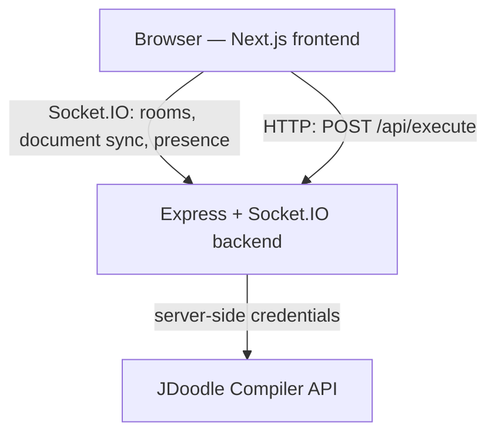

# DevSync

A lightweight real-time collaborative code editor. Create a room, share the invite link,
edit together, run the code, and download the shared source.

## Features

- **Shareable rooms.** Every room is a `/room/<id>` link. Anyone who opens it picks a
  display name and joins.
- **Real-time editing.** The document is synchronised across everyone in the room as it is
  typed.
- **Presence and typing.** The participant list shows who is in the room and who is
  currently typing.
- **Distinct participants.** Two people may use the same display name and stay separate;
  membership is keyed on the connection, not the name.
- **Reconnect handling.** A dropped connection reconnects and rejoins its room on its own.
- **A 15-second grace window.** An empty room keeps its document for 15 seconds, so a
  refresh or a brief network drop does not discard anyone's work.
- **Code execution.** JavaScript, TypeScript, Python, C++ and Java run through the backend,
  with stdout and errors shown in an output panel.
- **A server-side execution proxy.** The JDoodle credentials live on the backend; the
  browser never sees them.
- **Execution limits.** 10 runs per minute per client and a 64 KiB source limit.
- **Language-aware download.** Download the current shared source as the conventional file
  type for the selected language.
- **Responsive UI.** The editor and the room controls work on a phone as well as a desktop.
- **Automated tests and CI.** A test suite covering both halves of the project, wired to
  GitHub Actions.

## Architecture



| Path      | Responsibility                                                                                                    |
| --------- | ----------------------------------------------------------------------------------------------------------------- |
| `web/`    | Next.js App Router frontend: landing page, room gate, editor workspace, output panel, download.                     |
| `server/` | Express + Socket.IO backend: room membership, document relay, the empty-room grace timer, and the execution proxy.  |

The frontend never talks to the execution vendor. It opens one Socket.IO connection for
collaboration and posts to `/api/execute` for runs; the backend holds the JDoodle
credentials, maps the language name to a runtime, and returns only the result.

Rooms live in the backend's process memory and are ephemeral. There is no database: a
restart drops every active room. Full detail in
[docs/architecture.md](docs/architecture.md).

## Documentation

The deeper documentation lives in [`docs/`](docs/README.md):

| Document | Covers |
| -------- | ------ |
| [architecture.md](docs/architecture.md) | System shape, responsibility boundary, room state, single-instance rationale. |
| [collaboration.md](docs/collaboration.md) | Rooms, identity, join/leave, document events, typing, reconnect, the grace window. |
| [execution.md](docs/execution.md) | The run path, the proxy, every limit, error semantics, download. |
| [testing.md](docs/testing.md) | What all 72 tests assert, and what CI runs. |
| [deployment.md](docs/deployment.md) | Vercel + Render, environment variables, CORS, cold starts, scaling. |
| [decisions.md](docs/decisions.md) | Why the design is what it is, and what each choice cost. |

## Tech stack

**Frontend** — Next.js 15, React 19, TypeScript, Tailwind CSS 4, react-simple-code-editor
with Prism for highlighting, Socket.IO client.

**Backend** — Node 24, Express, Socket.IO, express-rate-limit.

**Testing** — Vitest and Testing Library for the frontend, Node's built-in `node:test`
runner for the backend integration suite, GitHub Actions for CI.

**Execution** — the JDoodle Compiler API, reached only through the backend proxy. The
free plan allows 20 API credits per day.

## Project structure

```
devsync-v1/
├── web/                  Next.js frontend
│   ├── src/
│   └── tests/
├── server/               Express + Socket.IO backend
│   ├── src/
│   └── tests/
├── docs/                 Technical documentation
├── .github/workflows/    CI
└── render.yaml           Backend deployment blueprint
```

## Prerequisites

- Node.js 24 and npm.
- A JDoodle Compiler API Client ID and Client Secret, **only** if you want code execution
  to work. Collaboration — rooms, editing, presence, download — works without them;
  `/api/execute` simply answers that execution is unavailable.
- No database.

## Local setup

The frontend and the backend are separate npm projects and run side by side.

**Backend**

```
cd server
npm ci
npm run dev
```

Create `server/.env` from `server/.env.example` first if you want to change the defaults or
enable code execution. The server reads that file through Node's built-in env-file support,
and it is optional — without it the defaults apply.

**Frontend**

```
cd web
npm ci
npm run dev
```

Create `web/.env.local` from `web/.env.example`. The frontend needs
`NEXT_PUBLIC_BACKEND_URL` to reach the backend, and refuses to open a socket without it.

The frontend then runs on `http://localhost:3000` and the backend on
`http://localhost:5000`.

## Environment variables

**`web/` — `.env.local`**

| Variable                  | Purpose                                                                                     |
| ------------------------- | ------------------------------------------------------------------------------------------- |
| `NEXT_PUBLIC_BACKEND_URL` | Public URL of the DevSync backend. Used for the Socket.IO connection and for execution runs. |

This one is public by design: `NEXT_PUBLIC_` values are compiled into the browser bundle.

**`server/` — `.env`**

| Variable                  | Purpose                                                                             |
| ------------------------- | ----------------------------------------------------------------------------------- |
| `FRONTEND_URL`            | The single origin allowed by CORS and Socket.IO. Defaults to `http://localhost:3000`. |
| `PORT`                    | Port the server listens on. Defaults to `5000`.                                       |
| `JDOODLE_CLIENT_ID`       | **Secret. Server-side only.** JDoodle Compiler API Client ID for `POST /api/execute`.  |
| `JDOODLE_CLIENT_SECRET`   | **Secret. Server-side only.** The matching Client Secret. Both are required; leave either empty to run DevSync without code execution. |
| `JDOODLE_API_URL`         | JDoodle execute endpoint. Not a secret. Defaults to `https://api.jdoodle.com/v1/execute`. |

Neither JDoodle credential may ever be given a `NEXT_PUBLIC_` name or copied into the
frontend environment. They belong to the server process alone. Real values are never
committed — both `.env.example` files are templates, and the real `.env` files are
ignored by Git.

## Development commands

**`web/`**

| Command             | Does                                              |
| ------------------- | ------------------------------------------------- |
| `npm run dev`       | Start the Next.js dev server.                     |
| `npm run build`     | Production build.                                 |
| `npm start`         | Serve the production build.                       |
| `npm test`          | Run the frontend test suite.                      |
| `npm run lint`      | ESLint over `src`, `tests` and the Vitest config. |
| `npm run typecheck` | `tsc --noEmit`.                                   |

**`server/`**

| Command       | Does                               |
| ------------- | ---------------------------------- |
| `npm run dev` | Start the server under nodemon.    |
| `npm start`   | Start the server.                  |
| `npm test`    | Run the backend integration suite. |

## Testing

72 automated tests: 39 on the frontend and 33 on the backend.

```
cd web && npm test
cd server && npm test
```

The frontend suite runs under Vitest in jsdom. The backend suite is integration-level: it
starts the real server as a child process and talks to it over real HTTP and real
Socket.IO, with execution tested against a fake JDoodle the tests start themselves, so it
needs no credentials and no network.

A GitHub Actions workflow runs both suites plus lint, typecheck, build, a syntax check and
dependency audits on pushes and pull requests. Neither job needs a secret. The workflow has
not run on GitHub yet — the repository has not been published — but the same commands pass
locally, including both audits at zero vulnerabilities.

Case-by-case detail in [docs/testing.md](docs/testing.md).

## Deployment

The frontend deploys to Vercel (root directory `web`) and the backend to Render (root
directory `server`, described by `render.yaml`). Two values are set in the Render dashboard
rather than in the blueprint: `FRONTEND_URL`, the exact Vercel production origin, and the
two JDoodle credentials.

Because the backend allows exactly one frontend origin, the two deployments have to be
introduced to each other in order: deploy the backend first to obtain its URL, deploy the
frontend with `NEXT_PUBLIC_BACKEND_URL` pointing at it, then set `FRONTEND_URL` on Render
and restart the backend.

Neither half is deployed yet. Full procedure in
[docs/deployment.md](docs/deployment.md).

## Limitations

These are the deliberate boundaries of this version, not defects.

- Rooms are held in the backend's memory. A restart or a redeploy drops every active room.
- An empty room keeps its document for 15 seconds and is then discarded.
- Synchronisation sends the whole document, last write wins. There is no CRDT and no
  operational transform, so two people typing in the same place at the same moment can
  overwrite each other.
- Editing pauses while a client is disconnected. There is no offline queue and no merge on
  reconnect.
- The backend is intentionally a single instance. Room membership, the document, the
  cleanup timers and the rate-limiter counters all live in one process, so running several
  instances would need shared external infrastructure that this version does not have.
- Code execution depends on the JDoodle Compiler API. If that service is unavailable or
  no credentials are configured, collaboration keeps working and runs report the failure.
- The free JDoodle plan allows 20 API credits per day, and each run spends one. Once the
  day's credits are gone, runs report that the daily limit is reached until the next day.
- On Render's free tier an idle service spins down, and the next request or WebSocket
  connection wakes it. That first connection can take up to about a minute, during which
  the UI shows its connecting and reconnecting states.
- There are no accounts, no database, and no per-project file tree. A room is one shared
  document.

The reasoning behind each is in [docs/decisions.md](docs/decisions.md).

## Security notes

- The JDoodle Client ID and Client Secret stay in the backend's environment and are sent
  only in the upstream request body. The browser calls `POST /api/execute` on the DevSync
  server and never contacts the execution vendor.
- Execution source is capped at 64 KiB of UTF-8, and runs are limited to 10 per minute per
  client. Behind Render's edge the limiter identifies clients by the trusted
  `CF-Connecting-IP` header, and only there — nowhere else is a proxy header believed, and
  no blanket `trust proxy` setting is enabled.
- Document sync is capped at 1 MiB.
- A socket may only write to a room it has actually joined, and the server labels typing
  with the name a socket joined under rather than the one the client sends.
- CORS and Socket.IO accept exactly one origin. There is no wildcard.
- No credential is committed. The repository contains `.env.example` templates only.
