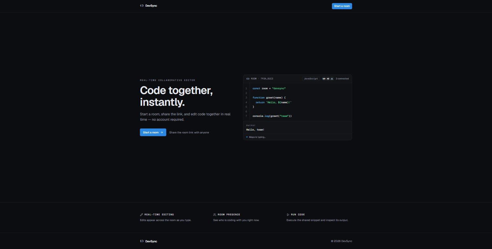
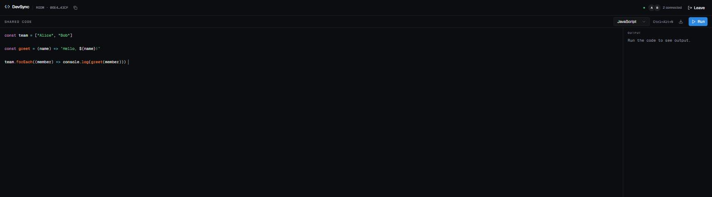
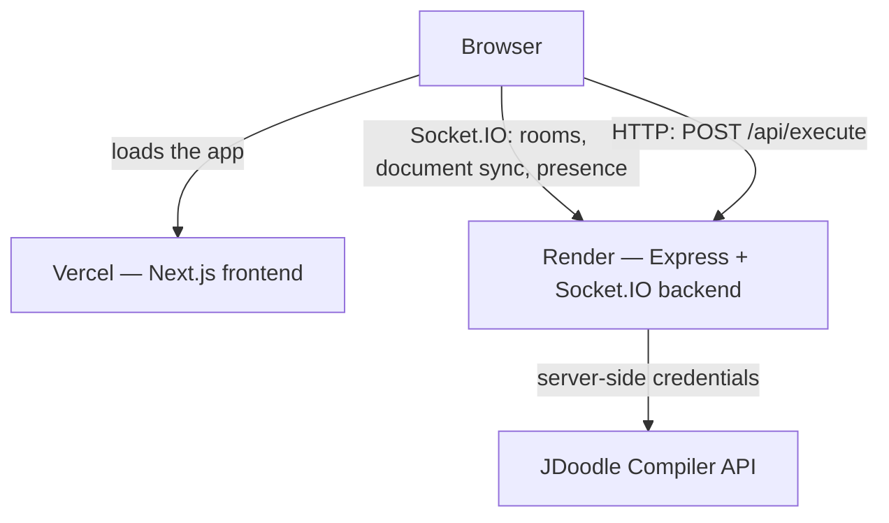
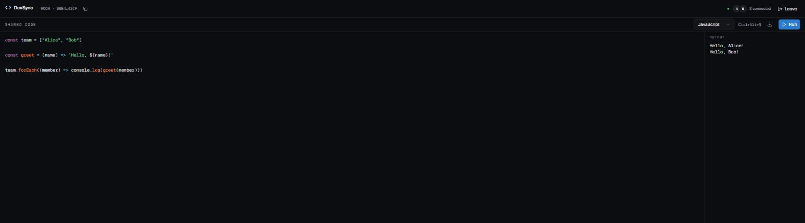

# DevSync

A lightweight real-time collaborative code editor. Create a room, share the link, edit
together, run the code, and download the shared source — no account required.

[](https://github.com/Youssef-Boussabah/DevSync/actions/workflows/ci.yml)

**Live demo:** <https://dev-sync-beryl.vercel.app> · **Repository:**
<https://github.com/Youssef-Boussabah/DevSync>



Everyone in a room sees the same document as it is typed, along with who else is present
and who is currently typing. A room is a URL: open it, pick a display name, and you are
in. Nothing is saved anywhere — rooms live in the backend's memory and are meant to be
temporary.

The editor highlights JavaScript, TypeScript, Python, C++ and Java, and can run all five
through a server-side execution proxy, showing program output and compiler diagnostics in
an output panel. The current source can be downloaded as the conventional file type for
the selected language.

## Live demo

<https://dev-sync-beryl.vercel.app>

1. Click **Start a room** and enter a display name.
2. Copy the room URL from the header and open it in a second browser or a private window —
   or send it to someone else.
3. Edit together. Every keystroke appears on the other side.
4. Optionally pick a language and press **Run** to execute the shared code.

The backend runs on Render's free tier, so the first request after a period of inactivity
may take longer while the service wakes. The UI shows its connecting state meanwhile, and
responds normally once the service is up.

Code execution uses the JDoodle Compiler API's free plan, which provides 20 API credits per
day for the whole demo, and each run spends one. If the day's credits are gone, runs report
that the daily limit has been reached; collaboration is unaffected either way.

## Features

**Real-time collaboration**

- Shareable rooms. Every room is a `/room/<id>` link; anyone who opens it picks a display
  name and joins.
- A synchronised document, updated across everyone in the room as it is typed.
- Participant presence in the room header.
- Typing indicators, labelled with the name a participant joined under.
- Distinct participants. Two people may use the same display name and stay separate;
  membership is keyed on the connection, not the name.
- Reconnect recovery. A dropped connection reconnects and rejoins its room on its own.
- A 15-second grace window. An empty room keeps its document for 15 seconds, so a refresh
  or a brief network drop does not discard anyone's work.

**Editor**

- Syntax highlighting for all five supported languages.
- Language selection, chosen per participant.
- Language-aware download of the current shared source.
- A responsive layout that works on a phone as well as a desktop.

**Execution**

- Five languages: JavaScript, TypeScript, Python, C++ and Java.
- A server-side execution proxy — the browser never holds provider credentials.
- Program output, compiler diagnostics and runtime errors in an output panel.
- Per-client rate limiting and a source-size cap.

**Infrastructure**

- Frontend on Vercel, backend on Render, execution through the JDoodle Compiler API.
- GitHub Actions CI on every push and pull request.



## Architecture



Vercel serves the frontend as static assets and does not proxy anything: once the app is
loaded, the browser talks to the Render backend directly, over one Socket.IO connection for
collaboration and over HTTP for runs. The backend is the only place that contacts the
execution vendor.

| Path      | Responsibility                                                                                                     |
| --------- | ------------------------------------------------------------------------------------------------------------------ |
| `web/`    | Next.js App Router frontend: landing page, room gate, editor workspace, output panel, download.                     |
| `server/` | Express + Socket.IO backend: room membership, document relay, the empty-room grace timer, and the execution proxy.  |

Room state — the roster, the document, and the cleanup timers — lives in the backend's
process memory. There is no database and nothing is written to disk, so rooms are
intentionally ephemeral and a restart drops every one of them. For the same reason the
backend runs as a **single instance**: all of that state is in one process. Full detail in
[docs/architecture.md](docs/architecture.md).

## Code execution

Runs are proxied. The browser posts the editor's text and the selected language name to the
DevSync backend, which holds the credentials, maps the language to a runtime, and returns
only the finished result. The browser never contacts the execution vendor and never
receives a credential.

| Aspect | Value |
| ------ | ----- |
| Provider | JDoodle Compiler API |
| Languages | JavaScript, TypeScript, Python, C++, Java |
| Credentials | Server-side only, never given a `NEXT_PUBLIC_` name |
| Source limit | 64 KiB of UTF-8 |
| Rate limit | 10 runs per minute per client IP |
| Upstream timeout | 15 seconds |
| Free plan quota | 20 API credits per day |

A compilation error or a failed run is the program's result, not an infrastructure failure:
both come back as a normal response carrying the diagnostic, and the output panel shows it.
Full detail in [docs/execution.md](docs/execution.md).



## Documentation

The deeper documentation lives in [`docs/`](docs/README.md):

| Document | Covers |
| -------- | ------ |
| [architecture.md](docs/architecture.md) | System shape, responsibility boundary, room state, single-instance rationale. |
| [collaboration.md](docs/collaboration.md) | Rooms, identity, join/leave, document events, typing, reconnect, the grace window. |
| [execution.md](docs/execution.md) | The run path, the proxy, every limit, error semantics, download. |
| [testing.md](docs/testing.md) | What all 72 tests assert, and what CI runs. |
| [deployment.md](docs/deployment.md) | The live deployment, environment variables, CORS, cold starts, scaling. |
| [decisions.md](docs/decisions.md) | Why the design is what it is, and what each choice cost. |

## Tech stack

**Frontend** — Next.js 15, React 19, TypeScript, Tailwind CSS 4, react-simple-code-editor
with Prism for highlighting, Socket.IO client.

**Backend** — Node 24, Express, Socket.IO, express-rate-limit.

**Testing** — Vitest and Testing Library for the frontend, Node's built-in `node:test`
runner for the backend integration suite, GitHub Actions for CI.

**Execution** — the JDoodle Compiler API, reached only through the backend proxy.

## Project structure

```
devsync-v1/
├── web/                  Next.js frontend
│   ├── src/
│   └── tests/
├── server/               Express + Socket.IO backend
│   ├── src/
│   └── tests/
├── docs/                 Technical documentation
│   └── images/           Screenshots used by this README
├── .github/workflows/    CI
└── render.yaml           Backend deployment blueprint
```

## Prerequisites

- Node.js 24 and npm.
- A JDoodle Compiler API Client ID and Client Secret, **only** if you want code execution
  to work. Collaboration — rooms, editing, presence, download — works without them;
  `/api/execute` simply answers that execution is unavailable.
- No database.

## Local setup

The frontend and the backend are separate npm projects and run side by side.

**Backend**

```
cd server
npm ci
npm run dev
```

Create `server/.env` from `server/.env.example` first if you want to change the defaults or
enable code execution. The server reads that file through Node's built-in env-file support,
and it is optional — without it the defaults apply.

**Frontend**

```
cd web
npm ci
npm run dev
```

Create `web/.env.local` from `web/.env.example`. The frontend needs
`NEXT_PUBLIC_BACKEND_URL` to reach the backend, and refuses to open a socket without it.

The frontend then runs on `http://localhost:3000` and the backend on
`http://localhost:5000`.

## Environment variables

**`web/` — `.env.local`**

| Variable                  | Purpose                                                                                     |
| ------------------------- | ------------------------------------------------------------------------------------------- |
| `NEXT_PUBLIC_BACKEND_URL` | Public URL of the DevSync backend. Used for the Socket.IO connection and for execution runs. |

This one is public by design: `NEXT_PUBLIC_` values are compiled into the browser bundle.

**`server/` — `.env`**

| Variable                  | Purpose                                                                             |
| ------------------------- | ----------------------------------------------------------------------------------- |
| `FRONTEND_URL`            | The single origin allowed by CORS and Socket.IO. Defaults to `http://localhost:3000`. |
| `PORT`                    | Port the server listens on. Defaults to `5000`.                                       |
| `JDOODLE_CLIENT_ID`       | **Secret. Server-side only.** JDoodle Compiler API Client ID for `POST /api/execute`.  |
| `JDOODLE_CLIENT_SECRET`   | **Secret. Server-side only.** The matching Client Secret. Both are required; leave either empty to run DevSync without code execution. |
| `JDOODLE_API_URL`         | JDoodle execute endpoint. Not a secret. Defaults to `https://api.jdoodle.com/v1/execute`. |

Neither JDoodle credential may ever be given a `NEXT_PUBLIC_` name or copied into the
frontend environment. They belong to the server process alone. Real values are never
committed — both `.env.example` files are templates, and the real `.env` files are
ignored by Git.

## Development commands

**`web/`**

| Command             | Does                                              |
| ------------------- | ------------------------------------------------- |
| `npm run dev`       | Start the Next.js dev server.                     |
| `npm run build`     | Production build.                                 |
| `npm start`         | Serve the production build.                       |
| `npm test`          | Run the frontend test suite.                      |
| `npm run lint`      | ESLint over `src`, `tests` and the Vitest config. |
| `npm run typecheck` | `tsc --noEmit`.                                   |

**`server/`**

| Command       | Does                               |
| ------------- | ---------------------------------- |
| `npm run dev` | Start the server under nodemon.    |
| `npm start`   | Start the server.                  |
| `npm test`    | Run the backend integration suite. |

## Testing

72 automated tests: 39 on the frontend and 33 on the backend.

```
cd web && npm test
cd server && npm test
```

The frontend suite runs under Vitest in jsdom. The backend suite is integration-level: it
starts the real server as a child process and talks to it over real HTTP and real
Socket.IO, with execution tested against a fake JDoodle the tests start themselves — so it
needs no credentials, no network, and spends no production API credits.

CI runs on every push and pull request. The frontend job runs the tests, lint, typecheck, a
production build and a dependency audit; the backend job runs the tests, a syntax check and
a dependency audit. Neither job needs a secret.

Case-by-case detail in [docs/testing.md](docs/testing.md).

## Deployment

DevSync is deployed and live.

| Half | Platform | URL |
| ---- | -------- | --- |
| Frontend | Vercel (Hobby), root directory `web` | <https://dev-sync-beryl.vercel.app> |
| Backend | Render (Free), root directory `server`, described by `render.yaml` | <https://devsync-server-3dko.onrender.com> |
| Execution | JDoodle Compiler API (Free) | — |

The two halves are wired to each other by exactly two public values:
`NEXT_PUBLIC_BACKEND_URL` on Vercel points at the Render backend, and `FRONTEND_URL` on
Render is the Vercel origin — the only origin CORS and Socket.IO accept. The JDoodle
credentials are set in the Render dashboard and exist nowhere else.

Deploying another instance, the order the two services have to be created in, and what
horizontal scaling would require are in [docs/deployment.md](docs/deployment.md).

## Limitations

These are the deliberate boundaries of this version, not defects.

- Rooms are held in the backend's memory. A restart or a redeploy drops every active room.
  There is no database and no persistence.
- An empty room keeps its document for 15 seconds and is then discarded.
- Synchronisation sends the whole document, last write wins. There is no CRDT and no
  operational transform, so two people typing in the same place at the same moment can
  overwrite each other.
- Editing pauses while a client is disconnected. There is no offline queue and no merge on
  reconnect.
- The backend is intentionally a single instance. Room membership, the document, the
  cleanup timers and the rate-limiter counters all live in one process, so running several
  instances would need shared external infrastructure that this version does not have.
- Code execution depends on the JDoodle Compiler API. If that service is unavailable or no
  credentials are configured, collaboration keeps working and runs report the failure.
- The free JDoodle plan allows 20 API credits per day, and each run spends one. Once the
  day's credits are gone, runs report that the daily limit is reached until the next day.
- On Render's free tier an idle service spins down, and the next request or WebSocket
  connection wakes it. That first connection can take noticeably longer, during which the
  UI shows its connecting and reconnecting states.
- There are no accounts, no authentication, and no per-project file tree. A room is one
  shared document.

The reasoning behind each is in [docs/decisions.md](docs/decisions.md).

## Security notes

- The JDoodle Client ID and Client Secret stay in the backend's environment and are sent
  only in the upstream request body. The browser calls `POST /api/execute` on the DevSync
  server and never contacts the execution vendor.
- Execution source is capped at 64 KiB of UTF-8, and runs are limited to 10 per minute per
  client. Behind Render's edge the limiter identifies clients by the trusted
  `CF-Connecting-IP` header, and only there — nowhere else is a proxy header believed, and
  no blanket `trust proxy` setting is enabled.
- Document sync is capped at 1 MiB.
- A socket may only write to a room it has actually joined, and the server labels typing
  with the name a socket joined under rather than the one the client sends.
- CORS and Socket.IO accept exactly one origin. There is no wildcard.
- No credential is committed. The repository contains `.env.example` templates only.
