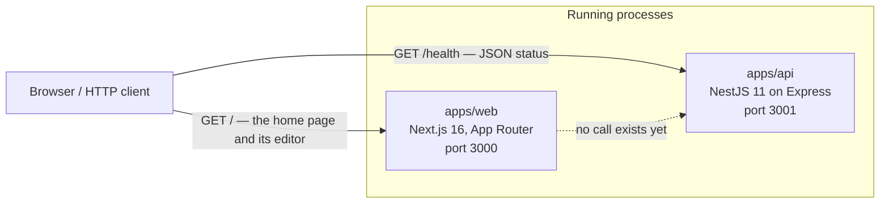
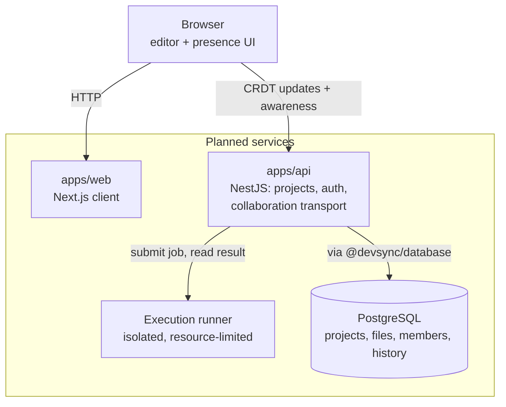

# Architecture

What DevSync is made of today, where the boundaries are drawn, and which of those boundaries are
real code rather than reserved space.

DevSync is intended to become a browser-based collaborative development environment. **Almost
none of that product exists yet.** What exists is a monorepo, two small applications — one of
which now hosts a Monaco editor — a shared configuration package, three testing layers, two
production images, and a CI workflow. This document describes that, and separates it from the
design the repository is being shaped towards.

## How to read this document

Everything below is labelled as exactly one of three things, and the labels are load-bearing:

| Label           | Meaning                                                                     |
| --------------- | --------------------------------------------------------------------------- |
| **Implemented** | Code exists, runs, and is exercised by a test or a check                    |
| **Reserved**    | A workspace and a boundary exist; the implementation is deliberately absent |
| **Planned**     | Neither code nor workspace-level commitment — a direction, and nothing more |

A planned system described in the present tense would make this document lie about the
repository, which is the specific failure it exists to prevent.

## The system today — implemented

Two independent HTTP applications, each serving one route, neither of which calls the other.



That dotted edge is the whole of the current inter-service story: `apps/web` serves a prerendered
page whose editor runs entirely in the browser, and never contacts `apps/api`. There is no shared
session, no proxy, no API client, and no serialisation format agreed between them. The first real
edge between the two applications belongs to the milestone that gives them something to say to
each other.

There is also no database, cache, queue, message broker, background worker, or scheduler
anywhere in the repository. Nothing DevSync runs today writes to persistent storage of any kind.

## Repository structure

A pnpm workspace with a Turborepo task graph over it. Nine workspaces, plus the root project that
owns the shared tooling.

```text
devsync/
├── apps/
│   ├── web/                  Next.js client                        implemented
│   └── api/                  NestJS HTTP service                   implemented
├── packages/
│   ├── config/               Shared TypeScript and ESLint config   implemented
│   ├── shared/               Types, schemas, protocol              reserved
│   ├── collaboration/        Real-time collaboration logic         reserved
│   ├── database/             Schema and data access                reserved
│   ├── ui/                   Reusable interface components         reserved
│   └── test-utils/           Shared test helpers                   reserved
├── tests/
│   └── e2e/                  Playwright browser and HTTP suite     implemented
├── .github/workflows/ci.yml  Quality, end-to-end, and Docker jobs  implemented
├── compose.yaml              The web and API services              implemented
├── turbo.json                Task graph
├── pnpm-workspace.yaml       Workspace globs: apps/*, packages/*, tests/*
└── prettier.config.mjs       Formatting, for the whole repository
```

| Workspace                | Package name             | Kind        | Builds | Emits            |
| ------------------------ | ------------------------ | ----------- | ------ | ---------------- |
| `apps/web`               | `@devsync/web`           | Application | `next` | `.next/`         |
| `apps/api`               | `@devsync/api`           | Application | `nest` | `dist/`          |
| `packages/config`        | `@devsync/config`        | Config      | no     | nothing          |
| `packages/shared`        | `@devsync/shared`        | Reserved    | no     | nothing          |
| `packages/collaboration` | `@devsync/collaboration` | Reserved    | no     | nothing          |
| `packages/database`      | `@devsync/database`      | Reserved    | no     | nothing          |
| `packages/ui`            | `@devsync/ui`            | Reserved    | no     | nothing          |
| `packages/test-utils`    | `@devsync/test-utils`    | Reserved    | no     | nothing          |
| `tests/e2e`              | `@devsync/e2e`           | Test suite  | no     | reports, ignored |

All nine participate in `pnpm lint` and `pnpm typecheck`. None is excluded from either, and the
two that build are the only two that produce a deployable artifact.

### Why the `packages/*` libraries do not build

Each is consumed as TypeScript source through its `exports` map — `".": "./src/index.ts"` — so
the application importing one compiles it. They are type-checked in place with `tsc --noEmit` and
never emit JavaScript. That keeps the workspace graph simple while there is nothing to publish,
and it means a package cannot go stale relative to its own build output, because it has none.

## `apps/web` — implemented

| Property     | Value                                                     |
| ------------ | --------------------------------------------------------- |
| Framework    | Next.js 16, App Router, React 19                          |
| Styling      | Tailwind CSS v4, through `@tailwindcss/postcss`           |
| Editor       | Monaco, through `@monaco-editor/react`                    |
| Routes       | `/` only                                                  |
| Alias        | `@/*` → `./src/*`                                         |
| Dev port     | 3000                                                      |
| Build output | `.next/`, including `.next/standalone` and `.next/static` |
| Tests        | Vitest, jsdom, 36 component tests                         |

`src/app/layout.tsx` declares the document metadata and loads two fonts through
`next/font/google`. `src/app/page.tsx` is a synchronous Server Component that renders the
project's name, a one-line description, an honest statement of what is not built yet, and the
workspace. **There is no file tree, no project view, no editor tabs, no state management library,
and no data fetching of any kind.**

### The workspace — implemented

`src/editor/local-editor-workspace.tsx` is a client component holding two pieces of React state:
the contents of the single open file, and the language those contents are read as. It seeds them
from a short TypeScript sample and TypeScript, passes both to the editor, and takes edits back
through a callback. That is the entire model — there is no file list, no file identifier, no
project, and no store.

Both are browser memory and only browser memory. Neither is ever read from or written to
`localStorage`, IndexedDB, a cookie, or the network, so unmounting the component or reloading the
page starts again from the sample, as TypeScript. That is the behaviour, not a limitation waiting
to be patched: the milestone that makes editing survive a reload is a later one, and it arrives
with a real store behind it.

Ownership matters more than it looks. Before this, the contents lived inside Monaco's model and no
other part of the application could read them; a language switch, a second pane, or a CRDT binding
would each have had to reach into the editor to find out what the user had typed. With the value in
React state, those become a matter of passing a prop — which is exactly what the language selection
below turned out to be.

### The language selection — implemented

`src/editor/languages.ts` is a five-entry readonly list, and it is the only source of truth for
what a language is: its Monaco identifier, the label a user reads, and the name the file is shown
under while it is being read that way.

| Label      | Monaco language | File shown as |
| ---------- | --------------- | ------------- |
| TypeScript | `typescript`    | `main.ts`     |
| JavaScript | `javascript`    | `main.js`     |
| Python     | `python`        | `main.py`     |
| JSON       | `json`          | `data.json`   |
| Markdown   | `markdown`      | `README.md`   |

**This is one file under five readings, not five files.** There is one buffer, and changing the
language changes only how Monaco interprets it: the content is passed through untouched, so nothing
is reset, translated, or replaced. There is no starter template per language, no language
detection, and no inference from a file name — the name is derived from the language, never the
other way round, and **nothing resolves it**. There is no path, directory, or second file it could
be distinguished from.

The control is a native `<select>` with a visible `<label>`, which is what a five-option choice
should be: keyboard behaviour, the accessible name, and the platform's own picker come for free,
and no component library was added to reproduce them. The DOM reports the chosen value as an
ordinary string, so it is resolved back against the list rather than asserted to belong to it; a
value that is not offered is ignored, which is what keeps the state narrowly typed with no cast.

The list lives in `apps/web` because it has exactly one consumer. It moves to `packages/` when a
second one exists, under the rule in [Boundaries stay separated](#boundaries-stay-separated) — not
before, and it needs no registry, plugin point, or configuration layer to get there.

### The editor — implemented

`src/editor/code-editor.tsx` renders one Monaco editor and is **controlled**: it displays the value
its caller gives it and reports edits back, rather than owning content of its own. Four properties
of it are architectural rather than cosmetic.

- **Monaco never runs on the server.** A client component is still rendered during SSR, and
  `monaco-editor` reads browser globals as it initialises, so the package is imported from an
  effect rather than at module scope. The route therefore still prerenders as static content, and
  the page's first paint is a loading message rather than an editor.
- **Monaco is bundled, not fetched.** `@monaco-editor/react` loads Monaco from a CDN by default;
  the component overrides that with `loader.config({ monaco })` so the copy in `node_modules` is
  the one used. Without this the production image would depend on a third-party host at runtime,
  which no other part of DevSync does.
- **Monaco's language workers are declared in application source.** Monaco points at its own
  worker entry points, but Turbopack copies those out of `node_modules` as static files instead of
  compiling them, and they fail on their first import. `src/editor/workers/` holds three one-line
  re-exports that Turbopack does compile — the editor's own worker, the TypeScript and JavaScript
  language service, and JSON's — and `MonacoEnvironment.getWorker` routes to them by label. A
  language service with a worker of its own needs an entry there, because the fallback answers the
  generic requests and none of the language-specific ones; Python and Markdown need none, as both
  are tokenised in the main thread.
- **A change without a value is not a change.** Monaco's callback reports `string | undefined`, and
  `undefined` means it had no content to hand over rather than that the file is now empty. It is
  dropped, so it can never blank the caller's state. An empty string is forwarded, because a file
  the user has cleared is a real edit.

Editor content lives in the browser and nowhere else. **Nothing is saved, sent, or shared**, and a
reload discards it.

Two configuration choices in `next.config.ts` matter to the rest of the system:

- **`output: 'standalone'`** emits a self-contained server tree, which is what the production
  image runs. It is an additional output, so `next dev` and `next start` are unaffected.
- **`outputFileTracingRoot`** points at the repository root. Left at its default, module tracing
  would begin at `apps/web` and miss everything pnpm resolved through the workspace store,
  producing a bundle that cannot boot.

## `apps/api` — implemented

| Property      | Value                                                       |
| ------------- | ----------------------------------------------------------- |
| Framework     | NestJS 11, on the Express platform adapter                  |
| Modules       | `AppModule` → `HealthModule` → `HealthController`           |
| Routes        | `GET /health`                                               |
| Configuration | `API_PORT`, read from the process environment, default 3001 |
| Dev port      | 3001                                                        |
| Build output  | `dist/`, compiled by `tsc` through the Nest CLI             |
| Tests         | Jest, 1 HTTP-level application test                         |

The whole service is one endpoint:

```http
GET /health  →  200  {"status":"ok","service":"devsync-api"}
```

The response shape is typed by the `HealthResponse` interface in
`src/health/health.controller.ts`, and the exact payload is asserted in three separate places —
the Jest test, the Playwright test, and the Docker job in CI — because it is the only contract
this repository currently has.

`main.ts` calls `app.listen(port)` with no host argument, so Node binds the unspecified address
and accepts both IPv4 and IPv6. That is deliberate: pinning it to `0.0.0.0` would narrow it to
IPv4 and break `localhost` on machines that resolve it to `::1` first, including Windows.

**There is no global prefix, no validation pipe, no exception filter, no interceptor, no guard,
no authentication, no CORS configuration, and no versioning scheme.** Each of those is a real
decision, and each belongs to the milestone that first needs it rather than to a foundation that
would only be guessing.

## `packages/config` — implemented

The only `packages/*` workspace with contents. It is private, never published, and contains no
runtime code: everything it exports is consumed at build, lint, or type-check time.

- **Five TypeScript configurations** — a strict `tsconfig.base.json` carrying correctness
  settings only, and four layered on top of it, one per kind of workspace: `package`, `nest`,
  `next`, and `playwright`.
- **Two ESLint builders** — `eslint/base` for `packages/*` and `apps/web`, and `eslint/nest`
  layered on it for `apps/api`.

Two deviations in `tsconfig.nest.json` are load-bearing rather than oversights: it omits
`verbatimModuleSyntax` and `lib`, because `emitDecoratorMetadata` needs injected classes to
survive as values. [`packages/config/README.md`](../packages/config/README.md) is the full
account of what each configuration sets and why.

Prettier is deliberately **not** owned here. It is configured once at the repository root, and
ESLint does not run it as a rule, so exactly one tool reformats code.

## Reserved package boundaries

Five workspaces exist, are linted and type-checked, and export nothing. Each `src/index.ts` is a
documented `export {}`.

| Package                  | Reserved for                                                        |
| ------------------------ | ------------------------------------------------------------------- |
| `@devsync/shared`        | Types, runtime schemas, constants, and the collaboration protocol   |
| `@devsync/collaboration` | The shared document model, CRDT bindings, awareness, room lifecycle |
| `@devsync/database`      | Schema, migrations, generated client, repository helpers            |
| `@devsync/ui`            | Presentational primitives shared by more than one front-end         |
| `@devsync/test-utils`    | Fixtures, harnesses, and assertions used by more than one workspace |

Reserving a boundary is not the same as designing what fills it. These workspaces exist so that
the first piece of genuinely shared code has an obvious home and does not get written into
`apps/web` and then copied into `apps/api`. They stay empty until something real needs them: a
placeholder class or a speculative type would be worse than an honest empty module, because it
would have to be unlearned before it could be used.

## `tests/e2e` — implemented

The only workspace allowed to start real processes. Playwright, Chromium only, seven tests across
two specs. It builds both applications, starts them on ports 4310 and 4311, waits on HTTP
readiness checks — never a fixed sleep — and shuts them down afterwards.

The three testing layers as a whole:

| Layer                  | Runner     | Location    | Runs against                         |
| ---------------------- | ---------- | ----------- | ------------------------------------ |
| Component              | Vitest     | `apps/web`  | React components in jsdom            |
| HTTP-level application | Jest       | `apps/api`  | A Nest app on an ephemeral socket    |
| Browser and full-stack | Playwright | `tests/e2e` | Both compiled applications, on ports |

Forty-four real tests in total. [`testing.md`](testing.md) covers what each layer proves, why the
API stays on Jest, and what is deliberately untested.

## Request and process boundaries

**Request boundaries.** Exactly two, both HTTP, both from a client outside the system:
`GET /` to `apps/web`, and `GET /health` to `apps/api`. No request crosses from one application
to the other. There is no WebSocket, no server-sent event stream, no long-poll, no GraphQL
endpoint, and no RPC layer.

**Process boundaries.** Each application is a separate operating-system process in every mode
DevSync runs in, and no mode runs them in the same process:

| Mode                | Processes                                   | Ports      |
| ------------------- | ------------------------------------------- | ---------- |
| `pnpm dev`          | `next dev`, `nest start --watch`            | 3000, 3001 |
| `pnpm test`         | Vitest and Jest workers; no servers         | none       |
| `pnpm test:e2e`     | `next start`, `node dist/main.js`, Chromium | 4310, 4311 |
| `docker compose up` | One container per application               | 3000, 3001 |

The end-to-end ports are far from the development pair on purpose, so a suite run cannot silently
test a server a developer started by hand. `reuseExistingServer` is off for the same reason.

## Environment and configuration

**DevSync loads no `.env` file.** There is no configuration module, no `@nestjs/config`, and no
`dotenv` anywhere in the repository. A variable that is not set in the shell, in `compose.yaml`,
or in the Playwright `webServer` block is not configured at all.

| Variable   | Read by                         | Default | Set where                  |
| ---------- | ------------------------------- | ------- | -------------------------- |
| `API_PORT` | `apps/api/src/main.ts`          | `3001`  | Shell, Compose, Playwright |
| `PORT`     | The Next.js standalone server   | `3000`  | Compose and the web image  |
| `HOSTNAME` | The Next.js standalone server   | —       | Compose and the web image  |
| `NODE_ENV` | Both frameworks, conventionally | —       | Compose and both images    |

`API_PORT` is the only variable the repository's own code reads; the other three are read by
frameworks. `.env.example` is the documented inventory, `.env` is git-ignored and reserved, and
`.dockerignore` keeps every `.env*` file out of both build contexts.

**This repository contains no secrets**, no credentials, and no external service configuration,
because there is no external service to authenticate against.

## Build and runtime outputs

| Workspace  | Command      | Output                       | Runtime entry point          |
| ---------- | ------------ | ---------------------------- | ---------------------------- |
| `apps/web` | `next build` | `.next/`, `.next/standalone` | `apps/web/server.js` (image) |
| `apps/api` | `nest build` | `dist/`                      | `dist/main.js`               |

`pnpm build` runs exactly these two. Every other workspace has no build step, so the task graph
resolves to two units of work. All build output, coverage, and test reports are git-ignored;
nothing generated by a build or a test run is tracked, and no test run modifies a tracked file.

## Containers — implemented

Two production images and one Compose file. [`docker.md`](docker.md) is the full account; the
architectural points are:

- **Both images build from the repository root.** A pnpm workspace cannot do a frozen install
  without the root lockfile, `pnpm-workspace.yaml`, and every workspace manifest, so a
  per-application build context cannot work.
- **Multi-stage, always.** Build tooling never reaches a runtime image. `apps/web` ships the
  Next.js standalone output with no package manager at all; `apps/api` ships `dist` plus a
  production-only install.
- **Both run compiled output as the image's non-root `node` user**, never a dev server, never
  root.
- **Each service declares an HTTP health check** that proves the application answers, not merely
  that a process is alive.
- **Compose contains the two applications and nothing else** — no database, cache, queue, volume,
  named network, or `depends_on` edge, because nothing uses one.

## Continuous integration — implemented

One workflow, [`.github/workflows/ci.yml`](../.github/workflows/ci.yml), with three independent
jobs. [`ci.md`](ci.md) is the full account.

| Job       | Validates                                                                  |
| --------- | -------------------------------------------------------------------------- |
| `quality` | Formatting, lint, types, in-process tests, and both builds                 |
| `e2e`     | Both applications start from a real build and answer in Chromium           |
| `docker`  | Both images build, start, become healthy, and serve the expected responses |

The jobs are deliberately independent, and CI runs the same commands a developer runs — there is
no CI-only script. The workflow holds `contents: read`, uses no secrets, and publishes nothing.

## Architectural principles

These are the durable rules later milestones are expected to follow. They are commitments about
_where things go_, not a description of code that exists — nothing in this section is
implemented, and several of the technologies named here are not installed.

### Boundaries stay separated

Web, API, collaboration, database, shared contracts, and UI concerns each keep their own
boundary. A concern that grows a second consumer moves into `packages/`; it is not duplicated
across applications, and it is not absorbed into whichever application happened to need it first.
The reserved workspaces are how that separation is kept cheap: the destination already exists, so
moving shared code there is a refactor rather than an argument.

Concretely: collaboration logic does not live in `apps/web`, data access does not live in
`apps/api`, and a type shared by client and server lives in `@devsync/shared` so the two cannot
drift apart.

### The server enforces authorization; the client is never trusted

When access control arrives, it is enforced on the server. A client may hide a control it
believes the user cannot use, but every decision that matters is made where the request is
handled — including collaboration messages, which are requests like any other. No client-supplied
claim about identity, membership, or role is taken at face value.

### Collaboration is CRDT-based, not broadcast

Real-time editing will synchronise through CRDT document updates, not by broadcasting whole file
contents. Sending a full document on every keystroke does not converge under concurrent edits, it
scales with file size rather than edit size, and it makes offline reconnection unresolvable. A
CRDT gives convergence as a property of the data structure instead of as a property of message
ordering.

The intended library is Yjs. **It is not installed, and no synchronisation code exists.**

### One Yjs document per project, initially

The expected starting model is a single Yjs document per project, with each file a sub-document
or a named shared type within it. One document per project keeps cross-file operations — renames,
moves, a multi-file undo — inside a single consistency domain, and it means one awareness channel
per room rather than one per open file.

This is a starting point recorded so the first implementation is a deliberate choice rather than
an accident. Per-file documents scale better for very large projects, and the trade-off is
expected to be revisited when a real project size makes it concrete.

### Presence is ephemeral and separate from persisted data

Cursors, selections, and who-is-here are awareness state: they live for the duration of a
connection and are never written to the durable store. Persisting presence would put the
highest-frequency, lowest-value data in the most expensive place, and every row would be garbage
the moment its connection dropped. Project content persists; presence does not.

### PostgreSQL owns durable records; Redis waits for a reason

When persistence arrives, PostgreSQL is the system of record for projects, files, memberships,
and history. One durable store, one place to look, one backup story.

**Redis is not introduced until scaling requires it** — specifically, until more than one API
instance has to share collaboration state or presence across processes. A single instance needs
no shared cache, and adding one before that point buys an extra deployment dependency, an extra
failure mode, and a cache-invalidation problem in exchange for nothing.

### Code execution runs outside the web and API processes

User-submitted code is never executed inside `apps/web` or `apps/api`. Execution gets its own
isolated runner with its own resource, filesystem, and network limits, and the API talks to it
across a boundary it does not trust. An API process that also runs user code has no meaningful
security boundary left: a sandbox escape becomes database access.

### Documentation separates what is from what is planned

Every document in `docs/` states which of its contents are implemented and which are direction.
A document that describes a planned system in the present tense is worse than no document,
because it cannot be distinguished from a description of reality. Documentation is updated in the
same change that makes it inaccurate.

## Planned architecture — none of this exists

The shape the system is being built towards. Each piece arrives in the milestone that needs it;
see [`roadmap.md`](roadmap.md) for the sequence.



- **The code editor driven by a CRDT-backed shared document.** Monaco is in the client already;
  Yjs is the intended CRDT and is not installed, so the editor is bound to nothing.
- **The API as the authority** over project data, membership, access control, and the
  collaboration transport. The transport is expected to be WebSocket-based; no WebSocket
  dependency exists.
- **PostgreSQL behind `@devsync/database`**, reached through one package rather than from
  controllers scattered across the API.
- **A separate execution runner**, isolated from both applications, for running user code.
- **Shared contracts published from `@devsync/shared`** — types, schemas, and the collaboration
  protocol — so client and server cannot disagree about the wire format.
- **Redis, only if and when horizontal scaling requires it.**

## What this architecture deliberately does not contain

Recorded so that their absence reads as a decision rather than an oversight. None of the
following exists anywhere in this repository:

- A database, ORM, migration tool, or any persistence — including browser storage: the workspace
  uses neither `localStorage`, `sessionStorage`, nor IndexedDB, and has no save action or
  saved/unsaved state, because there is nowhere to save to
- Authentication, sessions, accounts, or authorization
- WebSockets, Socket.IO, or any real-time transport
- A CRDT library or any collaboration code — the editor exists, but it is bound to nothing
- Code execution, sandboxing, or a runner service
- Redis, a cache, a queue, or a message broker
- A shared type, schema, or protocol definition — `@devsync/shared` exports nothing
- Deployment configuration, Kubernetes manifests, cloud infrastructure, or release automation
- A dependency bot, a changelog, or a versioning scheme

## Related documents

| Document                           | Covers                                                  |
| ---------------------------------- | ------------------------------------------------------- |
| [`development.md`](development.md) | Prerequisites, commands, ports, and daily workflow      |
| [`testing.md`](testing.md)         | The three testing layers and what each proves           |
| [`docker.md`](docker.md)           | Image structure, Compose, and container limitations     |
| [`ci.md`](ci.md)                   | The GitHub Actions workflow and its jobs                |
| [`decisions.md`](decisions.md)     | Why each of these choices was made, and when to revisit |
| [`roadmap.md`](roadmap.md)         | The milestone sequence and current position             |
