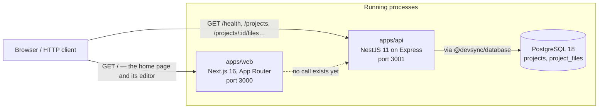
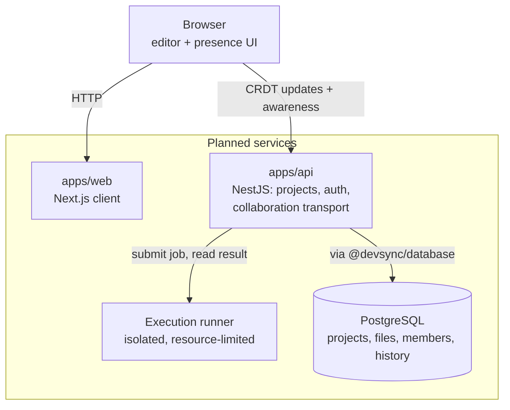

# Architecture

What DevSync is made of today, where the boundaries are drawn, and which of those boundaries are
real code rather than reserved space.

DevSync is intended to become a browser-based collaborative development environment. **Almost
none of that product exists yet.** What exists is a monorepo, two small applications — one of
which now hosts a Monaco editor — a shared configuration package, a PostgreSQL data layer, an HTTP
API over that data layer, the contracts the API validates against, six testing layers, two
production images, and a CI workflow. This document describes that, and separates it from the
design the repository is being shaped towards.

## How to read this document

Everything below is labelled as exactly one of three things, and the labels are load-bearing:

| Label           | Meaning                                                                     |
| --------------- | --------------------------------------------------------------------------- |
| **Implemented** | Code exists, runs, and is exercised by a test or a check                    |
| **Reserved**    | A workspace and a boundary exist; the implementation is deliberately absent |
| **Planned**     | Neither code nor workspace-level commitment — a direction, and nothing more |

A planned system described in the present tense would make this document lie about the
repository, which is the specific failure it exists to prevent.

## The system today — implemented

Two independent HTTP applications, neither of which calls the other, and a PostgreSQL database that
one of them serves projects and files out of.



That dotted edge is the whole of the current inter-service story: `apps/web` serves a prerendered
page whose editor runs entirely in the browser, and never contacts `apps/api`. There is no shared
session, no proxy, no API client, and no CORS configuration — nothing cross-origin exists to allow.
The first real edge between the two applications belongs to C3.

**The database edge carries real traffic from C2.** Ten routes create, read, change, and delete
projects and the files inside them, through `@devsync/database` and nothing else. **No user can
reach any of it**: the only thing `apps/web` renders is an in-memory editor, so a person using
DevSync still cannot save or load anything. An HTTP client can.

There is still no cache, queue, message broker, background worker, or scheduler anywhere in the
repository.

## Repository structure

A pnpm workspace with a Turborepo task graph over it. Nine workspaces, plus the root project that
owns the shared tooling.

```text
devsync/
├── apps/
│   ├── web/                  Next.js client                        implemented
│   └── api/                  NestJS HTTP service                   implemented
├── packages/
│   ├── config/               Shared TypeScript, ESLint, Vitest     implemented
│   ├── database/             PostgreSQL schema and data access     implemented
│   ├── shared/               Request, response, and error schemas  implemented
│   ├── collaboration/        Real-time collaboration logic         reserved
│   ├── ui/                   Reusable interface components         reserved
│   └── test-utils/           Shared test helpers                   reserved
├── tests/
│   └── e2e/                  Playwright browser and HTTP suite     implemented
├── .github/workflows/ci.yml  Quality, database, e2e, Docker jobs   implemented
├── compose.yaml              web, api, PostgreSQL, and migrate     implemented
├── turbo.json                Task graph
├── pnpm-workspace.yaml       Workspace globs: apps/*, packages/*, tests/*
└── prettier.config.mjs       Formatting, for the whole repository
```

| Workspace                | Package name             | Kind            | Builds | Emits            |
| ------------------------ | ------------------------ | --------------- | ------ | ---------------- |
| `apps/web`               | `@devsync/web`           | Application     | `next` | `.next/`         |
| `apps/api`               | `@devsync/api`           | Application     | `nest` | `dist/`          |
| `packages/config`        | `@devsync/config`        | Config          | no     | nothing          |
| `packages/database`      | `@devsync/database`      | Runtime library | `tsc`  | `dist/`          |
| `packages/shared`        | `@devsync/shared`        | Runtime library | `tsc`  | `dist/`          |
| `packages/collaboration` | `@devsync/collaboration` | Reserved        | no     | nothing          |
| `packages/ui`            | `@devsync/ui`            | Reserved        | no     | nothing          |
| `packages/test-utils`    | `@devsync/test-utils`    | Reserved        | no     | nothing          |
| `tests/e2e`              | `@devsync/e2e`           | Test suite      | no     | reports, ignored |

All nine participate in `pnpm lint` and `pnpm typecheck`. None is excluded from either, and the
four that build are the only four that produce a deployable artifact.

### Why most `packages/*` libraries do not build, and why two do

Each reserved package is consumed as TypeScript source through its `exports` map —
`".": "./src/index.ts"` — so the application importing one compiles it. They are type-checked in
place with `tsc --noEmit` and never emit JavaScript. That keeps the workspace graph simple while
there is nothing to publish, and it means a package cannot go stale relative to its own build
output, because it has none.

**`@devsync/database` and `@devsync/shared` are the exceptions**, made so by C1 and C2. Both run
inside the API's production container, where there is no compiler: shipping TypeScript and hoping
Node executes it is not an option, and neither is a runtime loader. So both build with `tsc` to
`dist/`, both point their `exports` map at the compiled JavaScript and the emitted declarations,
and `apps/api` depends on those builds — which is why `build` and `typecheck` in `turbo.json` wait
for them. Both extend `@devsync/config/tsconfig.library.json`, a configuration that exists for
exactly this kind of workspace.

Both emit **CommonJS**, and for one reason: `apps/api` compiles to CommonJS and its ts-jest suite
loads modules through a CommonJS registry that cannot `require` an ES module. `@devsync/shared`
therefore carries no `"type": "module"`, which is what makes `module: NodeNext` produce CommonJS
from it.

## `apps/web` — implemented

| Property     | Value                                                     |
| ------------ | --------------------------------------------------------- |
| Framework    | Next.js 16, App Router, React 19                          |
| Styling      | Tailwind CSS v4, through `@tailwindcss/postcss`           |
| Editor       | Monaco, through `@monaco-editor/react`                    |
| Routes       | `/` only                                                  |
| Alias        | `@/*` → `./src/*`                                         |
| Dev port     | 3000                                                      |
| Build output | `.next/`, including `.next/standalone` and `.next/static` |
| Tests        | Vitest, jsdom, 36 component tests                         |

`src/app/layout.tsx` declares the document metadata and loads two fonts through
`next/font/google`. `src/app/page.tsx` is a synchronous Server Component that renders the
project's name, a one-line description, an honest statement of what is not built yet, and the
workspace. **There is no file tree, no project view, no editor tabs, no state management library,
and no data fetching of any kind.**

### The workspace — implemented

`src/editor/local-editor-workspace.tsx` is a client component holding two pieces of React state:
the contents of the single open file, and the language those contents are read as. It seeds them
from a short TypeScript sample and TypeScript, passes both to the editor, and takes edits back
through a callback. That is the entire model — there is no file list, no file identifier, no
project, and no store.

Both are browser memory and only browser memory. Neither is ever read from or written to
`localStorage`, IndexedDB, a cookie, or the network, so unmounting the component or reloading the
page starts again from the sample, as TypeScript. That is the behaviour, not a limitation waiting
to be patched: the milestone that makes editing survive a reload is a later one, and it arrives
with a real store behind it.

Ownership matters more than it looks. Before this, the contents lived inside Monaco's model and no
other part of the application could read them; a language switch, a second pane, or a CRDT binding
would each have had to reach into the editor to find out what the user had typed. With the value in
React state, those become a matter of passing a prop — which is exactly what the language selection
below turned out to be.

### The language selection — implemented

`src/editor/languages.ts` is a five-entry readonly list carrying three things per language: its
Monaco identifier, the label a user reads, and the name the file is shown under while it is being
read that way.

| Label      | Monaco language | File shown as |
| ---------- | --------------- | ------------- |
| TypeScript | `typescript`    | `main.ts`     |
| JavaScript | `javascript`    | `main.js`     |
| Python     | `python`        | `main.py`     |
| JSON       | `json`          | `data.json`   |
| Markdown   | `markdown`      | `README.md`   |

**This is one file under five readings, not five files.** There is one buffer, and changing the
language changes only how Monaco interprets it: the content is passed through untouched, so nothing
is reset, translated, or replaced. There is no starter template per language, no language
detection, and no inference from a file name — the name is derived from the language, never the
other way round, and **nothing resolves it**. There is no path, directory, or second file it could
be distinguished from.

The control is a native `<select>` with a visible `<label>`, which is what a five-option choice
should be: keyboard behaviour, the accessible name, and the platform's own picker come for free,
and no component library was added to reproduce them. The DOM reports the chosen value as an
ordinary string, so it is resolved back against the list rather than asserted to belong to it; a
value that is not offered is ignored, which is what keeps the state narrowly typed with no cast.

#### Who owns a language identifier — a boundary mid-move

**C2 moved the identifiers, and only the identifiers.** `@devsync/shared` now owns the five values a
file may be persisted and served as — `SUPPORTED_LANGUAGE_IDS` and `languageIdSchema` — and
`apps/api` validates every request against them. That is where the authoritative list lives.

**`apps/web` does not consume `@devsync/shared` yet.** It imports nothing from the package, makes no
request to `apps/api`, and is unchanged by C2. So until C3 the browser list **repeats the same five
identifier strings**, and that duplication is real rather than hidden: two lists, one authoritative,
temporarily agreeing by inspection instead of by import.

What stays in `apps/web` permanently is the presentation half — the labels a user reads and the file
name currently derived from the selected language. Those are interface decisions, and
`@devsync/shared` deliberately carries neither, because it ships in the browser bundle and has no
business holding copy.

**C3 closes the gap.** It makes `apps/web` the package's second consumer, at which point the
identifier strings come from the shared list and the local copy disappears; a file's name also stops
being derived from its language, because by then a file has a stored name of its own. Until that
happens the browser still shows exactly what this section describes: one in-memory buffer, viewed
under five Monaco languages.

### The editor — implemented

`src/editor/code-editor.tsx` renders one Monaco editor and is **controlled**: it displays the value
its caller gives it and reports edits back, rather than owning content of its own. Four properties
of it are architectural rather than cosmetic.

- **Monaco never runs on the server.** A client component is still rendered during SSR, and
  `monaco-editor` reads browser globals as it initialises, so the package is imported from an
  effect rather than at module scope. The route therefore still prerenders as static content, and
  the page's first paint is a loading message rather than an editor.
- **Monaco is bundled, not fetched.** `@monaco-editor/react` loads Monaco from a CDN by default;
  the component overrides that with `loader.config({ monaco })` so the copy in `node_modules` is
  the one used. Without this the production image would depend on a third-party host at runtime,
  which no other part of DevSync does.
- **Monaco's language workers are declared in application source.** Monaco points at its own
  worker entry points, but Turbopack copies those out of `node_modules` as static files instead of
  compiling them, and they fail on their first import. `src/editor/workers/` holds three one-line
  re-exports that Turbopack does compile — the editor's own worker, the TypeScript and JavaScript
  language service, and JSON's — and `MonacoEnvironment.getWorker` routes to them by label. A
  language service with a worker of its own needs an entry there, because the fallback answers the
  generic requests and none of the language-specific ones; Python and Markdown need none, as both
  are tokenised in the main thread.
- **A change without a value is not a change.** Monaco's callback reports `string | undefined`, and
  `undefined` means it had no content to hand over rather than that the file is now empty. It is
  dropped, so it can never blank the caller's state. An empty string is forwarded, because a file
  the user has cleared is a real edit.

Editor content lives in the browser and nowhere else. **Nothing is saved, sent, or shared**, and a
reload discards it.

Two configuration choices in `next.config.ts` matter to the rest of the system:

- **`output: 'standalone'`** emits a self-contained server tree, which is what the production
  image runs. It is an additional output, so `next dev` and `next start` are unaffected.
- **`outputFileTracingRoot`** points at the repository root. Left at its default, module tracing
  would begin at `apps/web` and miss everything pnpm resolved through the workspace store,
  producing a bundle that cannot boot.

## `apps/api` — implemented

| Property      | Value                                                                               |
| ------------- | ----------------------------------------------------------------------------------- |
| Framework     | NestJS 11, on the Express platform adapter                                          |
| Modules       | `AppModule` → `ApiConfigModule`, `DatabaseModule`, `HealthModule`, `ProjectsModule` |
| Routes        | `GET /health`, plus five project routes and five nested project-file routes         |
| Validation    | Zod schemas from `@devsync/shared`, through two pipes. No DTO classes               |
| Errors        | One API-owned error type and one global exception filter                            |
| Body limit    | 1 MiB of JSON, set once at bootstrap                                                |
| Configuration | `API_PORT` (default 3001) and `DATABASE_URL` (required), via `.env`                 |
| Dev port      | 3001                                                                                |
| Build output  | `dist/`, compiled by `tsc` through the Nest CLI                                     |
| Tests         | Jest: 46 fast, and 110 against a real PostgreSQL under `pnpm test:db`               |

```http
GET    /health                              →  200  {"status":"ok","service":"devsync-api"}

POST   /projects                            →  201  ProjectDetailResource
GET    /projects                            →  200  ProjectResource[]
GET    /projects/:projectId                 →  200  ProjectDetailResource
PATCH  /projects/:projectId                 →  200  ProjectResource
DELETE /projects/:projectId                 →  204  (no body)

POST   /projects/:projectId/files           →  201  ProjectFileResource
GET    /projects/:projectId/files           →  200  ProjectFileSummaryResource[]
GET    /projects/:projectId/files/:fileId   →  200  ProjectFileResource
PATCH  /projects/:projectId/files/:fileId   →  200  ProjectFileResource
DELETE /projects/:projectId/files/:fileId   →  204  (no body)
```

**No global prefix, no version segment, and no envelope.** Routes answer with resources and arrays
directly; a `{ data: … }` wrapper would be a shape invented for a problem nobody has, and a `/api`
prefix would be a path segment nothing routes on.

### How a request is handled — implemented

Four small pieces, in the order a request meets them.

- **`src/http-application.ts`** owns the settings that are the application's rather than a module's:
  the 1 MiB JSON parser, the middleware that turns an unreadable body into a DevSync error, and the
  global exception filter. **`main.ts` and the integration tests call the same function**, so the
  suite exercises the application that actually runs rather than one configured differently.
- **`src/common/contract.pipe.ts`** is one pipe over the schemas in `@devsync/shared`, exposed as
  `validatedBody` and `validatedPath`. Its input is `unknown`, so nothing downstream can be reached
  by a value that has not been through a contract, and the two entry points differ only in the code
  a failure carries: `VALIDATION_FAILED` for a body, `INVALID_IDENTIFIER` for a URL. There are no
  DTO classes and no decorator metadata — a class carrying `class-validator` decorators cannot be
  shared with the browser, and the schema is what C3 needs to read.
- **Controllers are thin.** They read the validated input, call a service, and return a mapped
  resource. `ProjectsService` and `ProjectFilesService` own the orchestration, the starter-file
  policy, and the interpretation of a lookup that came back `null`.
- **`src/common/api-exception.filter.ts`** is the one place a failure becomes a response. It
  serialises the API's own error type, maps any persistence failure that escaped a service, and
  leaves an unmatched route to the framework — there is no stable code for a URL that is not part of
  the API, and inventing one would grow the contract for a failure no client can provoke.

`src/common/resources.ts` maps storage records to wire resources, one property at a time.
**Timestamps become UTC ISO-8601 strings there and nowhere else**, and a record is never spread into
a response, so a column added to a table for storage reasons cannot appear on the wire by accident.

### Configuration and the database connection — implemented

`src/config/api-configuration.ts` is the only place the API reads its environment. It runs while
the module graph is being built, so a missing or malformed value fails startup with a message
naming the variable rather than surfacing later as a connection to nowhere. `API_PORT` stays
optional and defaults to 3001; `DATABASE_URL` is required, must be a PostgreSQL URL, and must name
a database. **There is no fallback**, deliberately: a service quietly writing to the wrong database
is worse than one that refuses to start. No failure message repeats the connection string, because
it carries a password.

`src/database/` holds three small pieces: an injection token, a provider that hands
`@devsync/database` the validated connection string, and a lifecycle service that connects during
`onModuleInit` and disconnects during `onModuleDestroy`. `main.ts` calls `enableShutdownHooks()`,
without which SIGTERM would kill the process before the pool was ever closed.

**`GET /health` was deliberately left alone again in C2.** It reports that the process is answering
and says nothing about the database, its host, the migration state, or how many projects there are.
It does not need to: the API cannot finish starting without a working connection, so a service that
answers at all has already proved one. A readiness endpoint that distinguishes "up" from "able to
serve" earns its place when a database that goes away _after_ startup has to be told apart from one
that was never there — which is C4's question, with C4's restart tests to make it concrete.

**There is still no interceptor, no guard, no authentication, no CORS configuration, and no
versioning scheme.** Every request is anonymous, which is why nothing in Phase C may be exposed to
an untrusted network.

The response shape is typed by the `HealthResponse` interface in
`src/health/health.controller.ts`, and the exact payload is asserted in four separate places — the
fast Jest test, the API integration suite, the Playwright test, and the Docker job in CI — because
everything else in the system watches it.

`main.ts` calls `app.listen(port)` with no host argument, so Node binds the unspecified address
and accepts both IPv4 and IPv6. That is deliberate: pinning it to `0.0.0.0` would narrow it to
IPv4 and break `localhost` on machines that resolve it to `::1` first, including Windows.

Each of those is a real decision, and each belongs to the milestone that first needs it rather than
to a foundation that would only be guessing.

## `packages/database` — implemented

The single place DevSync talks to PostgreSQL, and the first `packages/*` workspace with runtime
code in it. [`../packages/database/README.md`](../packages/database/README.md) is the full account;
the architectural points are these.

| Property     | Value                                                          |
| ------------ | -------------------------------------------------------------- |
| ORM          | Prisma 7, through the `@prisma/adapter-pg` driver adapter      |
| Database     | PostgreSQL 18                                                  |
| Schema       | `prisma/schema.prisma` — `Project` and `ProjectFile`           |
| Migrations   | One, committed, applied with `prisma migrate deploy`           |
| Client       | Generated to `src/generated/prisma`, git-ignored, reproducible |
| Build output | `dist/`, CommonJS, including the compiled client               |
| Tests        | Vitest, 39 integration tests against real PostgreSQL           |

- **Nothing is constructed at import time.** `createDatabase({ connectionString })` builds the
  adapter, the client, and the pool; until a caller supplies a connection string there is no pool.
  The package reads no environment variable and has no default, which is what stops it from ever
  talking to a database nobody chose.
- **The client never escapes.** Callers get named operations over projects and files, closed over a
  client they cannot reach. Replacing Prisma is a change inside this package rather than a
  repository-wide edit.
- **No Prisma error escapes either.** Failures are classified into four meanings — not found,
  unique violation, unavailable, unknown — with the original exception kept as `cause` for a log.
  The API maps meanings to status codes and never reads an ORM exception.
- **The ORM-independent half is a file, not a claim.** `src/contracts.ts` holds the records, the
  operation interfaces, `Database`, `PersistenceFailure`, and `PersistenceError`, and imports
  nothing from Prisma; everything that touches the generated client depends on it rather than the
  reverse. That is what lets a consumer — or a test — name a `PersistenceError` without a generated
  client existing, which is how `pnpm test` stays build-free.
- **A Prisma model type is not a contract.** Every operation maps rows onto the package's own
  record types, so a column added for storage reasons cannot appear on the wire by accident.
- **The starter file is the caller's.** `createWithInitialFile` writes both rows in one
  transaction and holds no opinion about what the first file is called or contains. That is a
  product decision, and it lives in `apps/api`.
- **A file change moves its project's `updatedAt`**, in the same transaction, so a project list
  ordered by recency reflects real work. A failed change rolls the timestamp back with it.
- **`project_files.name` is pinned to the `C` collation** by the migration, by hand, because Prisma
  cannot express one. Without it, whether `README.md` and `readme.md` collide would depend on the
  locale the server was initialised with.

The package emits **CommonJS**. That is not a preference: `apps/api` compiles to CommonJS and its
Jest suite loads modules through ts-jest's CommonJS registry, which cannot `require` an ES module.
Prisma's `prisma-client` generator is told `moduleFormat = "cjs"` for the same reason.

It also exports one subpath, `@devsync/database/test-database`: the disposable-database safety gate
and the reset-and-migrate helper, so that the API's integration suite can prepare the same database
without carrying a second copy of the rules. Nothing in `src/` imports it, so it never reaches a
runtime image.

## `packages/shared` — implemented

The contracts `apps/web` and `apps/api` have to agree on, and the second `packages/*` workspace with
runtime code in it. [`../packages/shared/README.md`](../packages/shared/README.md) is the full
account; the architectural points are these.

| Property     | Value                                          |
| ------------ | ---------------------------------------------- |
| Validation   | Zod 4                                          |
| Build output | `dist/`, CommonJS, with declarations           |
| Consumers    | `apps/api` from C2; `apps/web` from C3         |
| Tests        | Vitest, 100 tests, in Node, inside `pnpm test` |

- **One definition per contract.** Every runtime schema and the TypeScript type beside it come from
  the same Zod declaration, so the check that runs and the type that compiles cannot drift apart.
- **Zod does not escape.** `parseContract(schema, input)` returns the parsed value or the issues
  already converted into the `{ path, message }` shape the error contract publishes. `apps/api`
  therefore depends on the contracts rather than on the validation library, and declares no Zod
  dependency of its own.
- **Nothing server-only.** No environment loading, no database, no NestJS, no React. The package
  ships in the browser bundle from C3, and a package that reads configuration cannot safely do that.
- **No presentation.** The five language identifiers live here; the labels a user reads and the file
  names a client shows do not.
- **It depends on no other workspace.** The dependency arrows all point at it.

## `packages/config` — implemented

The only `packages/*` workspace with contents. It is private, never published, and contains no
runtime code: everything it exports is consumed at build, lint, or type-check time.

- **Five TypeScript configurations** — a strict `tsconfig.base.json` carrying correctness
  settings only, and four layered on top of it, one per kind of workspace: `package`, `nest`,
  `next`, and `playwright`.
- **Two ESLint builders** — `eslint/base` for `packages/*` and `apps/web`, and `eslint/nest`
  layered on it for `apps/api`.

Two deviations in `tsconfig.nest.json` are load-bearing rather than oversights: it omits
`verbatimModuleSyntax` and `lib`, because `emitDecoratorMetadata` needs injected classes to
survive as values. [`packages/config/README.md`](../packages/config/README.md) is the full
account of what each configuration sets and why.

Prettier is deliberately **not** owned here. It is configured once at the repository root, and
ESLint does not run it as a rule, so exactly one tool reformats code.

## Reserved package boundaries

Three workspaces exist, are linted and type-checked, and export nothing. Each `src/index.ts` is a
documented `export {}`. `@devsync/database` was the fifth until C1 filled it, and `@devsync/shared`
the fourth until C2 did.

| Package                  | Reserved for                                                        |
| ------------------------ | ------------------------------------------------------------------- |
| `@devsync/collaboration` | The shared document model, CRDT bindings, awareness, room lifecycle |
| `@devsync/ui`            | Presentational primitives shared by more than one front-end         |
| `@devsync/test-utils`    | Fixtures, harnesses, and assertions used by more than one workspace |

Reserving a boundary is not the same as designing what fills it. These workspaces exist so that
the first piece of genuinely shared code has an obvious home and does not get written into
`apps/web` and then copied into `apps/api`. They stay empty until something real needs them: a
placeholder class or a speculative type would be worse than an honest empty module, because it
would have to be unlearned before it could be used.

**C2 filled `@devsync/shared` on exactly those terms.** What arrived is a contract the API validates
every request against — real code with a real consumer — not a guess about what a client might one
day want. It gained no collaboration, authentication, membership, or version-history types on the
way past.

## `tests/e2e` — implemented

The only workspace allowed to start real processes. Playwright, Chromium only, eight tests across
three specs. It builds both applications, starts them on ports 4310 and 4311, waits on HTTP
readiness checks — never a fixed sleep — and shuts them down afterwards. `specs/web/local-editor.spec.ts`
is the one place that drives the real Monaco editor rather than markup DevSync owns.

The six testing layers as a whole:

| Layer                  | Runner     | Location            | Runs against                                    |
| ---------------------- | ---------- | ------------------- | ----------------------------------------------- |
| Contract               | Vitest     | `packages/shared`   | Schemas, in Node, in-process                    |
| Component              | Vitest     | `apps/web`          | React components in jsdom                       |
| HTTP-level application | Jest       | `apps/api`          | A Nest app on an ephemeral socket               |
| Database integration   | Vitest     | `packages/database` | A real PostgreSQL, migrated                     |
| API integration        | Jest       | `apps/api`          | The real `AppModule`, over that same PostgreSQL |
| Browser and full-stack | Playwright | `tests/e2e`         | Both compiled applications, on ports            |

Three hundred and fifty-seven real tests in total, of which the two integration layers are the only
ones needing an external service — which is why they share one command, `pnpm test:db`, and why
`pnpm test` still starts nothing. [`testing.md`](testing.md) covers what each layer proves, why the
API stays on Jest, and what is deliberately untested.

## Request and process boundaries

**Request boundaries.** From outside the system, both HTTP: `GET /` to `apps/web`, and eleven routes
on `apps/api` — `GET /health` plus the ten project and file routes above. No request crosses from
one application to the other. Inside, there is one more: `apps/api` to PostgreSQL, over the
connection `@devsync/database` owns. There is no WebSocket, no server-sent event stream, no
long-poll, no GraphQL endpoint, and no RPC layer.

**Process boundaries.** Each application is a separate operating-system process in every mode
DevSync runs in, and no mode runs them in the same process:

| Mode                | Processes                                                                    | Ports            |
| ------------------- | ---------------------------------------------------------------------------- | ---------------- |
| `pnpm dev`          | `next dev`, `nest start --watch`                                             | 3000, 3001       |
| `pnpm test`         | Vitest and Jest workers over source; no build, no servers                    | none             |
| `pnpm test:db`      | One Vitest worker then one Jest worker, against a PostgreSQL neither started | 5433 (client)    |
| `pnpm test:e2e`     | `next start`, `node dist/main.js`, Chromium                                  | 4310, 4311       |
| `docker compose up` | `web`, `api`, and PostgreSQL containers, plus the one-shot `migrate`         | 3000, 3001, 5433 |

PostgreSQL is the one process DevSync does not start for itself in development: Compose runs it,
and both `pnpm test:db` and `pnpm test:e2e` connect to it rather than launching one. A suite that
started its own database would be a suite that could pass without the Compose file being right.

The end-to-end ports are far from the development pair on purpose, so a suite run cannot silently
test a server a developer started by hand. `reuseExistingServer` is off for the same reason.

## Environment and configuration

**DevSync loads `.env` from C1 onward**, through `@nestjs/config` in `apps/api` and through
`dotenv` in the database and end-to-end tooling. A value already present in the environment always
wins over the file, which is how Compose and CI keep control of their own configuration.

| Variable            | Read by                                   | Default | Set where                          |
| ------------------- | ----------------------------------------- | ------- | ---------------------------------- |
| `API_PORT`          | `apps/api`, through its configuration     | `3001`  | `.env`, shell, Compose, Playwright |
| `DATABASE_URL`      | `apps/api`, passed to `@devsync/database` | none    | `.env`, shell, Compose             |
| `TEST_DATABASE_URL` | The database and end-to-end test tooling  | none    | `.env`, shell, CI                  |
| `PORT`              | The Next.js standalone server             | `3000`  | Compose and the web image          |
| `HOSTNAME`          | The Next.js standalone server             | —       | Compose and the web image          |
| `NODE_ENV`          | Both frameworks, conventionally           | —       | Compose and both images            |

**`DATABASE_URL` has no default and never gets one.** A missing or malformed value fails startup
with a message naming the variable; falling back to some other database is the failure mode the
requirement exists to prevent. **`TEST_DATABASE_URL` is never read by the API** — an unset one
means "the database tests were not asked for", not "this service is misconfigured" — and the
tooling that does read it refuses any database it cannot prove is disposable.

Neither database URL ever reaches the browser. `apps/web` receives no database configuration of any
kind, and none may be exposed through a `NEXT_PUBLIC_` variable.

`.env.example` is the documented inventory, `.env` is git-ignored, and `.dockerignore` keeps every
`.env*` file out of both build contexts.

**This repository contains no secrets.** The PostgreSQL credentials in `compose.yaml` and
`.env.example` are development values, stated openly, for a database that exists on a developer's
own machine.

## Build and runtime outputs

| Workspace           | Command      | Output                       | Runtime entry point          |
| ------------------- | ------------ | ---------------------------- | ---------------------------- |
| `apps/web`          | `next build` | `.next/`, `.next/standalone` | `apps/web/server.js` (image) |
| `apps/api`          | `nest build` | `dist/`                      | `dist/main.js`               |
| `packages/database` | `tsc`        | `dist/`                      | required by `apps/api`       |
| `packages/shared`   | `tsc`        | `dist/`                      | required by `apps/api`       |

`pnpm build` runs exactly these four, in dependency order: `apps/api` compiles against
`packages/database/dist` and `packages/shared/dist`, so both packages build first. The data layer's
own build is preceded by a `generate` task that writes Prisma Client into `src/generated/prisma` —
**it reads the schema and nothing else, so no database is involved in a build**, and a fresh
checkout can `pnpm build` before anyone has configured one.

All build output, generated client code, coverage, and test reports are git-ignored; nothing
generated by a build or a test run is tracked, and no test run modifies a tracked file.

## Containers — implemented

Two production images and one Compose file. [`docker.md`](docker.md) is the full account; the
architectural points are:

- **Both images build from the repository root.** A pnpm workspace cannot do a frozen install
  without the root lockfile, `pnpm-workspace.yaml`, and every workspace manifest, so a
  per-application build context cannot work.
- **Multi-stage, always.** Build tooling never reaches a runtime image. `apps/web` ships the
  Next.js standalone output with no package manager at all; `apps/api` ships `dist` plus a
  production-only install naming the three workspaces that genuinely run — `@devsync/api`,
  `@devsync/database`, and, since C2, `@devsync/shared` and the Zod it brings with it. That install
  declines optional dependencies, which is what keeps `@prisma/client`'s optional peers — the Prisma
  CLI and the TypeScript compiler — out of the image entirely.
- **Both run compiled output as the image's non-root `node` user**, never a dev server, never
  root.
- **Each application service declares an HTTP health check** that proves it answers, not merely
  that a process is alive; PostgreSQL declares a `pg_isready` check.
- **Compose runs four services**: `web`, `api`, PostgreSQL, and a one-shot `migrate` that applies
  the committed migrations and exits. The API waits for the database to be healthy **and** for that
  migration to have succeeded, so no API instance can serve against a schema that is not there, and
  two of them starting at once cannot race through it.
- **The database's data lives in a named volume.** `docker compose down` keeps it; only
  `down --volumes` destroys it.
- **There is still no `depends_on` from `web` to `api`**, because `apps/web` still makes no request
  to `apps/api`. That edge arrives in C3.

## Continuous integration — implemented

One workflow, [`.github/workflows/ci.yml`](../.github/workflows/ci.yml), with four independent
jobs. [`ci.md`](ci.md) is the full account.

| Job        | Validates                                                                                                             |
| ---------- | --------------------------------------------------------------------------------------------------------------------- |
| `quality`  | Formatting, lint, types, in-process tests, and every build                                                            |
| `database` | The database package and the API's persistence routes against a real PostgreSQL, with the committed migration applied |
| `e2e`      | Both applications start from a real build and answer in Chromium                                                      |
| `docker`   | Every image builds, the migration exits 0, and each service becomes healthy                                           |

The jobs are deliberately independent, and CI runs the same commands a developer runs — there is
no CI-only script. The workflow holds `contents: read`, uses no secrets, and publishes nothing.

## Architectural principles

These are the durable rules later milestones are expected to follow. They are commitments about
_where things go_, not a description of code that exists — nothing in this section is
implemented, and several of the technologies named here are not installed.

### Boundaries stay separated

Web, API, collaboration, database, shared contracts, and UI concerns each keep their own
boundary. A concern that grows a second consumer moves into `packages/`; it is not duplicated
across applications, and it is not absorbed into whichever application happened to need it first.
The reserved workspaces are how that separation is kept cheap: the destination already exists, so
moving shared code there is a refactor rather than an argument.

Concretely: collaboration logic does not live in `apps/web`, data access does not live in
`apps/api`, and a type shared by client and server lives in `@devsync/shared` so the two cannot
drift apart.

### The server enforces authorization; the client is never trusted

When access control arrives, it is enforced on the server. A client may hide a control it
believes the user cannot use, but every decision that matters is made where the request is
handled — including collaboration messages, which are requests like any other. No client-supplied
claim about identity, membership, or role is taken at face value.

### Collaboration is CRDT-based, not broadcast

Real-time editing will synchronise through CRDT document updates, not by broadcasting whole file
contents. Sending a full document on every keystroke does not converge under concurrent edits, it
scales with file size rather than edit size, and it makes offline reconnection unresolvable. A
CRDT gives convergence as a property of the data structure instead of as a property of message
ordering.

The intended library is Yjs. **It is not installed, and no synchronisation code exists.**

### One Yjs document per project, initially

The expected starting model is a single Yjs document per project, with each file a sub-document
or a named shared type within it. One document per project keeps cross-file operations — renames,
moves, a multi-file undo — inside a single consistency domain, and it means one awareness channel
per room rather than one per open file.

This is a starting point recorded so the first implementation is a deliberate choice rather than
an accident. Per-file documents scale better for very large projects, and the trade-off is
expected to be revisited when a real project size makes it concrete.

### Presence is ephemeral and separate from persisted data

Cursors, selections, and who-is-here are awareness state: they live for the duration of a
connection and are never written to the durable store. Persisting presence would put the
highest-frequency, lowest-value data in the most expensive place, and every row would be garbage
the moment its connection dropped. Project content persists; presence does not.

### PostgreSQL owns durable records; Redis waits for a reason

PostgreSQL is the system of record for projects and files, and will be for memberships and history
when those exist. One durable store, one place to look, one backup story. **Projects and files are
implemented**; nothing else on that list is.

**Redis is not introduced until scaling requires it** — specifically, until more than one API
instance has to share collaboration state or presence across processes. A single instance needs
no shared cache, and adding one before that point buys an extra deployment dependency, an extra
failure mode, and a cache-invalidation problem in exchange for nothing.

### Code execution runs outside the web and API processes

User-submitted code is never executed inside `apps/web` or `apps/api`. Execution gets its own
isolated runner with its own resource, filesystem, and network limits, and the API talks to it
across a boundary it does not trust. An API process that also runs user code has no meaningful
security boundary left: a sandbox escape becomes database access.

### Documentation separates what is from what is planned

Every document in `docs/` states which of its contents are implemented and which are direction.
A document that describes a planned system in the present tense is worse than no document,
because it cannot be distinguished from a description of reality. Documentation is updated in the
same change that makes it inaccurate.

## Planned architecture — almost none of this exists

The shape the system is being built towards. Each piece arrives in the milestone that needs it;
see [`roadmap.md`](roadmap.md) for the sequence. One edge below is real — the API to PostgreSQL,
through `@devsync/database` — and every other edge and box is still a direction.



- **The code editor driven by a CRDT-backed shared document.** Monaco is in the client already;
  Yjs is the intended CRDT and is not installed, so the editor is bound to nothing.
- **The API as the authority** over project data, membership, access control, and the
  collaboration transport. **Project data is now real**; membership, access control, and the
  transport are not. The transport is expected to be WebSocket-based; no WebSocket dependency
  exists.
- **PostgreSQL behind `@devsync/database`**, reached through one package rather than from
  controllers scattered across the API. **This one is built**, and it is the only box below that
  is; what it still lacks is anything above it that asks it a question.
- **A separate execution runner**, isolated from both applications, for running user code.
- **Shared contracts published from `@devsync/shared`** — types, schemas, and eventually the
  collaboration protocol — so client and server cannot disagree about the wire format. **The HTTP
  half is built and the API consumes it**; the client does not yet, and the protocol does not exist.
- **Redis, only if and when horizontal scaling requires it.**

## Phase C — the persistence architecture

C0 decided this; C1 built the storage half; C2 built the HTTP surface over it. **Everything in this
section is implemented** — the data model, the routes, the error contract, the request size limit,
the package boundaries, the Prisma and migration policy, and the configuration rules.

**Nothing in the product reaches any of it.** `apps/web` makes no request to `apps/api`, so a person
using DevSync still cannot save or load a project; an HTTP client can do all of it.
[`roadmap.md`](roadmap.md) has the C0–C5 sequence and what each milestone must meet;
[`decisions.md`](decisions.md) has the reasoning behind each choice and what would justify revisiting
it.

### What Phase C is, and what it refuses to prepare for

Phase C is **single-user**. It gives DevSync projects and files that survive a restart, so that
later phases have something worth sharing, and it stops there.

There are no users, owners, memberships, roles, invitations, or authorization checks; no slug,
visibility, archival, or soft deletion; no folders, paths, or file trees; and no collaboration,
presence, version history, chat, or execution. Those absences are the design, not a gap in it: a
nullable `ownerId` or a `deletedAt` added now would be a column nobody writes, a constraint nobody
enforces, and a shape Phase H would have to unpick before it could use it. **Phase C adds no
placeholder column and no placeholder contract for anything on that list.**

### The data model — implemented

Two records, one relationship, both in `packages/database/prisma/schema.prisma` and in the
committed migration. `ProjectFile` is the implementation-level name for the second one — `File` is
a browser global, and a model that shadows it would read ambiguously in exactly the package where
both meanings are plausible.

#### Project

```text
id         opaque UUID, generated by the persistence layer
name       required, trimmed, 1–100 characters
createdAt  server-generated
updatedAt  server-generated; moves on file changes too, see below
```

The name is trimmed before it is persisted, and a name that is empty or entirely whitespace is
invalid rather than stored. **Project names are not unique** — two projects may share one, because
a person naming two things the same has not made an error worth rejecting, and uniqueness would
need a scope that does not exist until there are owners. 100 characters is a practical ceiling for
a label that appears in a list, chosen so the column is bounded rather than because anything
measured it; the number is C0's to set and C5's to correct if the interface disagrees with it.

Deletion is permanent. There is no archive state, no `deletedAt`, and no restore route.

#### ProjectFile

```text
id         opaque UUID, generated by the persistence layer
projectId  references exactly one project
name       required, trimmed, 1–255 characters, unique within its project
language   one of the supported identifiers, stored as an ordinary string
content    text; empty is valid
createdAt  server-generated
updatedAt  server-generated
```

- **A file belongs to exactly one project, and deleting the project deletes its files** —
  permanently, by a cascade in the schema rather than by a loop in application code.
- **Names are flat.** No folder, no path, no parent, and no ordering column. `README.md` is a name,
  not a location, and nothing in Phase C parses it.
- **A name is unique within one project and free in every other.** Two projects may each hold a
  `main.ts`; one project may not hold two.
- **That uniqueness is deliberately case-sensitive** — a product decision, not something inherited
  from whatever the database happens to do. `README.md` alongside `readme.md` is a strange project
  rather than a broken one, and case-insensitive uniqueness would need a rule about which spelling
  survives that nothing has asked for. **The migration pins `project_files.name` to the `C`
  collation** so the comparison is byte-wise wherever it is applied; Prisma cannot express a
  collation, so that one line is written by hand, with the reason in the SQL. Two integration tests
  hold it: `README.md` and `readme.md` coexist, and a second `README.md` is rejected.
- **`language` is a string, validated at the API boundary, not a database enum.** The supported
  values are the five `apps/web` already offers — `typescript`, `javascript`, `python`, `json`, and
  `markdown` — and they move to `@devsync/shared` in C2, together with the validator that checks
  them. Adding a sixth must be a change to that list and its validator, not a migration: an enum
  type would make the database the authority on a set that is really Monaco's, and would tie every
  new language to a schema change and a deployment ordering problem.
- **`content` is text, and empty is valid content.** That is already the rule the editor follows —
  `code-editor.tsx` forwards an emptied file as a real edit and drops only Monaco's `undefined` —
  and persistence must not quietly reintroduce a distinction the editor deliberately does not make.
- **The name and the language are independent stored properties.** Renaming a file must not change
  its language, and changing its language must not rename it. This is the one place where Phase C
  deliberately breaks with Phase B, where the file name is derived from the language and there is
  only ever one buffer.

#### Identifiers and timestamps

Identifiers are opaque UUIDs generated by the persistence layer. A client does not choose one, and
a malformed one is a `400` rather than a lookup that happens to miss.

`createdAt` and `updatedAt` are generated by the server and the database, never accepted from a
request. They are stored in time-zone-aware columns and returned over HTTP as UTC ISO-8601 strings,
so the wire format carries no local time and no ambiguity for the browser to guess at.

**`Project.updatedAt` means "when this project last changed", not "when this row was last
written".** It is set at creation and moves when the project is renamed, when a file is created,
renamed, retyped, edited, or deleted. A file mutation updates its parent project's timestamp **in
the same transaction** that changes the file, so the two can never disagree about whether the change
happened.

That definition is what makes the project list orderable by recent work without a speculative
`lastActivityAt` column: the column already exists, and Phase C simply says what it counts.
`ProjectFile.updatedAt` is the ordinary meaning — when that file last changed.

#### Creating a project creates its first file

A new project is created together with one file, **in a single transaction**: `main.ts`, in
TypeScript, holding the starter content `LocalEditorWorkspace` opens with today. An empty project
would greet its creator with nothing to click, and a client that had to follow every create with a
second request would leave a project with no files behind whenever the second one failed.

The ownership split matters more than the behaviour:

- **`apps/api` owns the policy** — that a new project gets a starter file, what it is called, what
  language it is, and what it contains.
- **`@devsync/database` owns the atomicity** — one transaction, both rows, and if either insert
  fails, neither record remains.

The database package must not invent starter content of its own. A persistence layer with an
opinion about what a new project should say is a persistence layer that has to be edited for a
product decision.

A project may later hold zero files, because deleting the last one is allowed. Nothing in the
product requires an undeletable file, and a rule that a project must always have one would be a
constraint invented for tidiness.

### The HTTP surface — implemented

Files are addressed under their project, because a file has no meaning outside one and a flat
`/files/:id` would make the project a query parameter on every request.

```http
POST   /projects
GET    /projects
GET    /projects/:projectId
PATCH  /projects/:projectId
DELETE /projects/:projectId

POST   /projects/:projectId/files
GET    /projects/:projectId/files
GET    /projects/:projectId/files/:fileId
PATCH  /projects/:projectId/files/:fileId
DELETE /projects/:projectId/files/:fileId
```

**`POST /projects`** takes `{ "name": "My project" }`, creates the project and its initial `main.ts`
atomically, and answers `201` with the project and its files — for a new project, the one file's
identifier, name, language, and timestamps. The caller can therefore open what it just created
without guessing an identifier or listing the project to find one.

**`GET /projects`** returns project summaries — the project's own fields, without files. They are
ordered **most recently updated first, with the identifier as the final tie-breaker**, so a listing
is stable when two projects share a timestamp. That ordering is only meaningful because
`Project.updatedAt` moves on file changes as well as renames, which is
[defined above](#identifiers-and-timestamps). **There is no pagination**, deliberately: one person
with a list of their own projects does not need it, and the route that would have to grow it is the
one Phase H rewrites anyway when projects acquire owners.

**`GET /projects/:projectId`** returns one project with a summary of each of its files — identifier,
name, language, timestamps — and **not** their contents. Files have their own resource; sending
every byte of a project on every open would make the cost of listing a project scale with the size
of the code in it.

**`PATCH /projects/:projectId`** renames the project. `name` is the only mutable project property in
Phase C, and a body containing no supported property is a `400` rather than a successful request
that changes nothing.

**`DELETE /projects/:projectId`** permanently deletes the project and, by cascade, every file in it.
`204`, with no body.

**`POST /projects/:projectId/files`** takes `{ "name": "utils.ts", "language": "typescript", "content": "" }`
and answers `201` with the created file. **`content` is optional and defaults to an empty string**;
a file created without content is empty, not absent, which is the same rule the model states and
the editor already follows.

**`GET /projects/:projectId/files`** returns the project's files, without their contents, **oldest
first by creation time with the identifier as the tie-breaker** — a stable order that does not
reshuffle the list every time someone types.

**`GET /projects/:projectId/files/:fileId`** returns one complete file, contents included. A file
that exists under a different project is a `404` here: the project in the path is part of the
lookup, not decoration, so an identifier cannot be read through the wrong project's URL.

**`PATCH /projects/:projectId/files/:fileId`** may change `name`, `language`, or `content`, in any
combination. **Sending all three is never required**, because saving a keystroke should not have to
restate the file's identity; a body with none of them is a `400`.

**`DELETE /projects/:projectId/files/:fileId`** permanently deletes the file. `204`, no body.

**Every route that creates, changes, or deletes a file also moves its project's `updatedAt`**, in
the transaction that made the change. There are no bulk, search, archive, restore, copy, move,
folder, or upload routes in Phase C.

#### Request size — implemented

**1 MiB of JSON**, applied once at bootstrap, so that a large paste or a malformed upload is
rejected before it becomes a row. Express defaults to 100 kB, which is small for a source file; a
mebibyte is comfortably more than any plausible one and still a clear boundary against accidental or
malformed input.

**A body over the limit is a `400`, not the `413` Express would produce.** So is one that is not
valid JSON. Both are the client having sent something DevSync could not read, both answer with the
same error resource as everything else, and neither exposes the parser's own body. The translation
happens in front of the router rather than in the exception filter, because Nest rewrites a parser's
`SyntaxError` into its own `BadRequestException` — message and all — before any filter is consulted.

That is the whole of Phase C's resource story. **It is not a quota system**: there is no per-project
size limit, no file-count limit, no rate limiting, and no accounting. Broad quotas and distributed
resource hardening belong to the later phases that own reliability and production concerns, and
moving them forward into Phase C would be building for a scale that does not exist.

### Errors — implemented

One shape, from every route, so the web application can read a failure without knowing which layer
produced it. `@devsync/database` classifies every persistence failure into one of four meanings, and
`apps/api` maps those meanings onto the table below.

| Status | Means                                                                           |
| ------ | ------------------------------------------------------------------------------- |
| `400`  | Malformed body, invalid UUID, unsupported language, or a patch with no property |
| `404`  | No such project, or no such file under the project in the path                  |
| `409`  | A file with that name already exists in that project                            |
| `503`  | The configured database is unreachable                                          |
| `500`  | Anything unexpected                                                             |

```json
{
  "statusCode": 409,
  "code": "FILE_NAME_TAKEN",
  "message": "A file named \"utils.ts\" already exists in this project.",
  "issues": [{ "path": ["name"], "message": "Already used in this project." }]
}
```

- **`statusCode`** is the HTTP status, repeated in the body so a logged response is self-contained.
- **`code`** is stable and machine-readable. It is what a client branches on.
- **`message`** is human-readable, for a log line or a toast. **Clients and tests must not parse
  it**, and it may be reworded without that being a contract change.
- **`issues`** is optional and carries field-level detail **whenever field-level detail is useful** —
  request validation, and field-specific conflicts such as a duplicate file name. Its shape is one
  documented thing: a list of `{ path, message }`, where `path` is the field's location in the
  request body. An error with nothing field-specific to say omits it entirely rather than sending an
  empty list.

The stable codes, all seven implemented and exported from `@devsync/shared` as `API_ERROR_CODES`:

| Code                   | Status | Raised when                                                                      |
| ---------------------- | ------ | -------------------------------------------------------------------------------- |
| `VALIDATION_FAILED`    | `400`  | A malformed body, an unsupported language, or a patch with no supported property |
| `INVALID_IDENTIFIER`   | `400`  | A path parameter that is not a well-formed UUID                                  |
| `PROJECT_NOT_FOUND`    | `404`  | No project with that identifier                                                  |
| `FILE_NOT_FOUND`       | `404`  | No file with that identifier under the project in the path                       |
| `FILE_NAME_TAKEN`      | `409`  | A file with that name already exists in that project                             |
| `DATABASE_UNAVAILABLE` | `503`  | The configured database cannot be reached                                        |
| `INTERNAL_ERROR`       | `500`  | Anything unexpected                                                              |

`INVALID_IDENTIFIER` is separate from `VALIDATION_FAILED` because it is worth telling a client that
the URL it built is wrong rather than the body it sent — a distinction the client can act on, which
is the only reason to add a code.

Nest's default error body is `{ statusCode, message, error }`, so producing this shape uniformly is
an exception filter rather than something the framework provides. **One exception is left to the
framework on purpose**: a request to a URL that is not a DevSync route. None of the seven codes
describes it, and adding an eighth would grow the contract for a failure no client of the API can
legitimately provoke.

**No error response may contain a Prisma error, a SQL fragment, a connection string, a stack trace,
or an internal table name.** The boundary is enforced in two places: `@devsync/database`
classifies persistence failures into meanings — not found, unique violation, unavailable, unknown —
and `apps/api` maps those meanings to the table above. The web application therefore consumes
stable HTTP errors and never inspects an ORM exception, which is what allows the ORM to be replaced
without touching the client.

Two failures are configuration rather than requests. **A missing or malformed `DATABASE_URL` fails
startup**, loudly, rather than defaulting to some other database. **A database that goes away after
startup** produces `503` and `DATABASE_UNAVAILABLE` from the persistence routes for as long as it is
gone; the mapping is implemented and covered by injecting the typed failure, and **actually stopping
PostgreSQL under a running API is C4's test**, not something to do in the middle of an integration
run. `GET /health` is a separate question, and whether it should start reporting readiness is C4's
to decide with those restarts in front of it.

### Where the code goes

```text
apps/web
  └── @devsync/shared

apps/api
  ├── @devsync/shared
  └── @devsync/database

@devsync/database
  └── Prisma and the PostgreSQL driver

@devsync/shared
  └── nothing — not apps/api, not apps/web, not @devsync/database
```

**`@devsync/database`** owns the Prisma schema, the migrations, client construction, the connection
lifecycle, the project and file data-access functions, the atomic project-plus-first-file creation,
transaction helpers, and the classification of persistence errors.

It does not own HTTP controllers, status codes, React, UI state, browser APIs, the runtime schemas
shared with the browser, the starter-project policy, authentication, or anything to do with
collaboration.

**`@devsync/shared`** owns the runtime request schemas, the response contracts, the TypeScript types
inferred from them, the supported language identifiers and their validator, and the error contract
above. Zod 4 is the validation library, and it stays inside: consumers run a schema through
`parseContract` and receive issues already in the published shape.

**C2 filled it**, with `apps/api` as its first consumer; `apps/web` becomes the second in C3. The
rule that had kept it empty is about speculation, not consumer arithmetic: a contract the API is
validating every request against is real, and waiting until C3 to publish it would have meant
writing the same schema twice and hoping the copies agree — the exact drift this package exists to
prevent. It gained no collaboration, authentication, membership, or version-history types on the way
past.

**`apps/api`** owns HTTP routing, validation wiring, application orchestration, the
project-creation starter values, and the mapping from persistence results and errors to responses.
It also owns configuration: it loads and validates `DATABASE_URL`, and it drives the database
package's connect and disconnect through Nest's lifecycle. **That dependency edge is C1's**, before
any route existed — a data layer the real API process never opens is a data layer nobody has proved.

**`apps/web`** will reach the API over HTTP and nothing else. **It makes no such call yet.** It must
never import `@devsync/database`, Prisma, a PostgreSQL client, or database configuration, and **the
browser must never connect to PostgreSQL**. A database credential that reaches a bundle is a
published credential.

### Prisma and migrations — implemented

Prisma 7 lives in `@devsync/database` — schema, migrations, and client construction all inside that
package. The client reaches PostgreSQL through the `@prisma/adapter-pg` driver adapter, so no query
engine binary ships anywhere.

- **One process, one client.** Construction and shutdown belong to the package; `apps/api` asks it
  to connect and disconnect through its lifecycle hooks. Controllers and React code construct
  nothing.
- **The package exposes operations, not an ORM.** Callers get functions named for projects and
  files, not an open connection they can run arbitrary queries through — otherwise the boundary is
  a directory rather than an abstraction, and replacing Prisma later becomes a repository-wide
  edit.
- **A Prisma model type is not an HTTP contract.** Responses are mapped to the shared resource
  shapes, so a column added for storage reasons does not silently appear on the wire.
- **Migrations are committed, and generated artifacts are reproducible and never hand-edited.**
  Generated client output stays out of the repository unless the Prisma version and generator in
  use require a repository-owned generated directory, in which case that requirement is documented
  where the decision is, not left to be inferred from a diff.
- **`prisma migrate dev` creates migrations in local development only. `prisma migrate deploy`
  applies committed ones** in CI, in Compose, and anywhere production-shaped. `prisma db push` is
  not the workflow for the tracked schema.
- **An applied migration is immutable.** A mistake is corrected by a new migration, because
  rewriting one that has already run somewhere leaves two databases that disagree about their own
  history. Names describe what the migration does.
- **Migrations run before the API serves persistence requests**, and production startup never
  creates a development migration. Compose expresses that as a one-shot `migrate` service the API
  waits on with `service_completed_successfully`, which is race-free however many API instances
  start at once.
- **A destructive reset is only ever pointed at a database that has been explicitly declared
  disposable.** The database suite drops a schema before it runs, and refuses to start against any
  database it cannot prove is throwaway. Verifying that a migration preserves existing data belongs
  to C4.

One migration exists, `create_projects_and_files`, and it is committed. Generated Prisma Client is
**not** committed: it is written to `src/generated/prisma`, git-ignored, and reproduced by the
`generate` task that `build`, `lint`, and `typecheck` all depend on — so a fresh checkout needs no
remembered command, and no generated file can drift from the schema it came from.

### Configuration — implemented

Three variables:

| Variable            | Read by                            | Required                                  |
| ------------------- | ---------------------------------- | ----------------------------------------- |
| `API_PORT`          | `apps/api/src/main.ts`             | No — defaults to 3001. **Already exists** |
| `DATABASE_URL`      | `apps/api` and `@devsync/database` | Yes, from C1 onward                       |
| `TEST_DATABASE_URL` | The database-backed test tooling   | Only while those tests run                |

**`DATABASE_URL` is required from C1 and validated when the API and database runtime starts.** A
missing or malformed value fails startup with a message naming the variable and what was wrong —
never a silent fallback to a default database, which is how a test suite ends up truncating
someone's development data.

**`TEST_DATABASE_URL` is read only by the database-backed integration-test tooling, and validated
only when those tests run.** Its absence is not a startup failure and must never stop the ordinary
API from starting — an unset test variable means "these tests were not asked for", not "this service
is misconfigured". The tests themselves refuse to run if it is missing, if it is obviously unsafe,
or if it is equal to `DATABASE_URL`.

**Neither database URL ever reaches the browser.** `apps/web` gets no database configuration of any
kind, and no such value may be exposed through a `NEXT_PUBLIC_` variable.

Loading and validation arrived together in C1, which is the milestone
[D11](decisions.md#d11--no-env-loading-yet) named as its trigger. `@devsync/shared` does not read
environment files and must not start: it is imported by the browser bundle from C3, and a package
that reads configuration cannot safely be. `.env.example` documents all three with non-secret
values.

### Compose, and testing

[`docker.md`](docker.md) owns the Compose topology — the PostgreSQL service, the named volume, the
health check, the migration service, and what `docker compose down` does and does not destroy.
[`testing.md`](testing.md) owns the testing ladder — what the data layer and the API prove today,
what C3 and C4 still have to prove, and why database-backed tests stay outside `pnpm test`.

### What Phase C changes about the editor

Phase B's editor holds one buffer and derives its file name from the selected language. Phase C
inverts that: a file has a stored name and a stored language, changed independently, and the
derived name in `apps/web/src/editor/languages.ts` stops being meaningful. **C3 is where the client
changes; C2 changed nothing in it.** The five language identifiers and their validator now live in
`@devsync/shared`, with everything else the API validates; the labels a user reads may stay in the
client, because they are presentation, and C3 is when the client starts reading the identifiers from
the shared package rather than from its own list.

The model-ownership problem recorded in [`testing.md`](testing.md) is **not** solved by Phase C.
Loading a file's contents into the editor is a controlled-value change like any other, and
user-paced typing is unaffected; it is Phase E's programmatic remote edits that force the question.

## What this architecture deliberately does not contain

Recorded so that their absence reads as a decision rather than an oversight. None of the
following exists anywhere in this repository:

- Any persistence a **user** can reach: no request from `apps/web` to `apps/api`, and no browser
  storage — the workspace uses neither `localStorage`, `sessionStorage`, nor IndexedDB, and has no
  save action or saved/unsaved state, because it has nowhere it can reach to save to. PostgreSQL and
  the routes over it exist; nothing in the interface leads to them.
- Authentication, sessions, accounts, or authorization — every request is anonymous, and every
  record is reachable by anything that can reach the API
- CORS configuration — nothing cross-origin exists to allow, and it arrives with C3's first call
- Pagination, search, bulk routes, upload routes, project templates, or seeded projects
- Rate limiting, per-project quotas, or any resource accounting beyond the 1 MiB body limit
- OpenAPI, Swagger, or GraphQL
- WebSockets, Socket.IO, or any real-time transport
- A CRDT library or any collaboration code — the editor exists, but it is bound to nothing
- Code execution, sandboxing, or a runner service
- Redis, a cache, a queue, or a message broker
- A collaboration protocol definition — `@devsync/shared` carries HTTP contracts and nothing else
- Deployment configuration, Kubernetes manifests, cloud infrastructure, or release automation
- A dependency bot, a changelog, or a versioning scheme

## Related documents

| Document                           | Covers                                                  |
| ---------------------------------- | ------------------------------------------------------- |
| [`development.md`](development.md) | Prerequisites, commands, ports, and daily workflow      |
| [`testing.md`](testing.md)         | The three testing layers and what each proves           |
| [`docker.md`](docker.md)           | Image structure, Compose, and container limitations     |
| [`ci.md`](ci.md)                   | The GitHub Actions workflow and its jobs                |
| [`decisions.md`](decisions.md)     | Why each of these choices was made, and when to revisit |
| [`roadmap.md`](roadmap.md)         | The milestone sequence and current position             |
